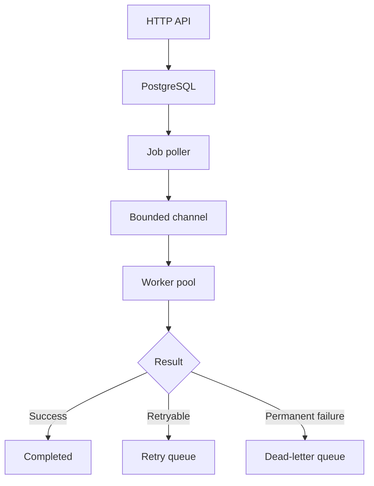

# Go: Four-Week Industry-Level Learning Roadmap

## Goal

Learn Go by building a production-style backend rather than completing disconnected syntax exercises.

- **Duration:** 4 weeks
- **Schedule:** 6 days per week
- **Time:** 2–3 hours per day
- **Recommended split:** 25% study, 60% building, 15% testing and revision
- **Current stable release when this roadmap was prepared (17 August 2026):** Go 1.26.6

Install Go from the [official download page](https://go.dev/dl/).

---

## Capstone Project: GoFlow

Build an asynchronous job-processing service inspired by systems such as Celery, Sidekiq, and managed queue workers.

A client submits a job through an HTTP API. GoFlow stores it, processes it using concurrent workers, retries temporary failures, and moves permanently failed jobs to a dead-letter queue.

### Final capabilities

- REST API
- PostgreSQL persistence
- Concurrent worker pool
- Bounded job queue and backpressure
- Per-job timeouts
- Exponential retries with jitter
- Dead-letter queue
- Idempotent processing
- Graceful shutdown
- Structured logging
- Metrics and profiling
- Unit, integration, race, benchmark, and fuzz tests
- Docker and CI
- Production-style documentation

### Final architecture



---

# Week 1: Go Foundations and Idiomatic Programming

## Module 1.1: Environment, packages, modules, and tooling

### Learn

- Installing Go and configuring an editor
- `go version` and `go env`
- `package main` and `func main`
- Packages versus modules
- Creating a module with `go mod init`
- Standard-library imports
- `go run`, `go build`, and `go install`
- `go fmt`, `go vet`, and `go test`
- Reading documentation with `go doc`
- Dependency management:
  - `go get`
  - `go mod tidy`
  - `go.mod`
  - `go.sum`
- Basic Git workflow

Go programs are organized into packages, and related packages are collected into modules defined by `go.mod`. See [How to Write Go Code](https://go.dev/doc/code).

### Project work

Create the initial repository:

```text
goflow/
├── cmd/
│   └── goflow/
│       └── main.go
├── internal/
├── go.mod
└── README.md
```

Implement a command that displays the application name, version, and available commands.

---

## Module 1.2: Language fundamentals

### Learn

- Variables and constants
- Short declaration with `:=`
- Primitive types and zero values
- Explicit type conversion
- `if`, `switch`, `for`, and `range`
- Functions
- Multiple return values
- Named returns
- Variadic functions
- `defer`
- Scope and variable shadowing
- `iota`

### Practice

- Find the maximum job priority
- Count jobs by status
- Validate job names
- Calculate retry delays
- Filter completed jobs

### Important Python-to-Go differences

- Go is statically typed.
- Unused imports and variables are compilation errors.
- Normal failures are represented by returned errors, not exceptions.
- `for` is Go's only loop construct.
- Collection behavior is more explicit than Python's.
- Capitalization controls whether an identifier is exported.

---

## Module 1.3: Arrays, slices, maps, strings, and runes

### Learn

- Arrays versus slices
- Slice length and capacity
- `append` and `copy`
- Slice backing arrays
- Nil versus empty slices
- Maps and key-existence checks
- Deleting map entries
- Strings, bytes, UTF-8, and runes
- `make` versus `new`
- Value semantics

### Industry pitfalls

- Retaining a large backing array through a small slice
- Unexpectedly modifying a shared slice
- Assuming map iteration order
- Accessing maps concurrently without synchronization
- Assuming one byte equals one character

### Project work

Create an in-memory job store:

```go
type Job struct {
    ID          string
    Type        string
    Payload     []byte
    Status      JobStatus
    Attempts    int
    MaxAttempts int
}
```

Support creating, retrieving, listing, updating, and deleting jobs.

---

## Module 1.4: Structs, methods, pointers, and interfaces

### Learn

- Struct definitions and literals
- Embedded structs
- Methods
- Value receivers versus pointer receivers
- Pointer fundamentals
- Escape analysis at a high level
- Interfaces and implicit implementation
- Type assertions and type switches
- Interface composition
- Constructor functions
- Dependency injection

Example boundary:

```go
type JobStore interface {
    Create(ctx context.Context, job Job) error
    Get(ctx context.Context, id string) (Job, error)
    Update(ctx context.Context, job Job) error
}
```

Define interfaces where they are consumed. Prefer small interfaces and avoid creating an interface for every struct.

---

## Module 1.5: Error handling

### Learn

- The `error` interface
- Returning and handling errors
- `errors.New`
- Error wrapping with `%w`
- `errors.Is` and `errors.As`
- Sentinel errors
- Custom error types
- Adding useful context
- `panic` and `recover`
- When panic is appropriate
- Defer execution order

```go
var ErrJobNotFound = errors.New("job not found")

func findJob(id string) (Job, error) {
    job, ok := jobs[id]
    if !ok {
        return Job{}, fmt.Errorf("find job %q: %w", id, ErrJobNotFound)
    }
    return job, nil
}
```

An error should be handled or returned with context. Avoid logging and returning the same error at every layer because that creates duplicate logs.

---

## Module 1.6: I/O, JSON, files, and configuration

### Learn

- `io.Reader` and `io.Writer`
- The `os` package
- Buffered I/O
- `encoding/json`
- JSON struct tags
- Custom JSON marshaling
- Environment variables
- `time.Time`
- Command-line arguments
- Resource cleanup with `defer`

### Week 1 deliverable

Build a CLI version of GoFlow:

```bash
goflow create --type email --payload '{"user_id":"123"}'
goflow list
goflow get <job-id>
goflow process <job-id>
```

Use JSON-file persistence initially.

### Week 1 checkpoint

Be able to explain:

- Array versus slice
- Value receiver versus pointer receiver
- Nil interface versus nil pointer
- Implicit interface implementation
- Why Go returns errors
- `%w`, `errors.Is`, and `errors.As`
- Package versus module
- Why `io.Reader` and `io.Writer` matter

---

# Week 2: HTTP APIs, Architecture, Databases, and Testing

## Module 2.1: Building HTTP servers

Start with the standard `net/http` package before using a web framework.

### Learn

- `http.Server`
- `http.Handler` and `http.HandlerFunc`
- `ServeMux`
- Routing and path parameters
- HTTP methods and status codes
- Request and response headers
- JSON request and response bodies
- Query parameters
- Request body limits
- Server timeouts
- Middleware
- Liveness and readiness endpoints

See the official [`net/http` documentation](https://pkg.go.dev/net/http).

### Project endpoints

```text
POST   /v1/jobs
GET    /v1/jobs
GET    /v1/jobs/{id}
DELETE /v1/jobs/{id}
POST   /v1/jobs/{id}/retry
GET    /health/live
GET    /health/ready
```

Use consistent errors:

```json
{
  "error": {
    "code": "JOB_NOT_FOUND",
    "message": "The requested job does not exist"
  }
}
```

---

## Module 2.2: Middleware and API reliability

Implement middleware for:

- Request IDs
- Structured request logging
- Panic recovery
- Authentication
- Request size limits
- Timeouts
- Content-type validation
- CORS only when required

Learn middleware chaining, request-scoped context values, authentication versus authorization, safe logging, and idempotency keys.

---

## Module 2.3: Project organization and architecture

Use a simple layered structure:

```text
goflow/
├── cmd/
│   ├── api/
│   │   └── main.go
│   └── worker/
│       └── main.go
├── internal/
│   ├── config/
│   ├── domain/
│   ├── service/
│   ├── repository/
│   ├── worker/
│   └── transport/
│       └── http/
├── migrations/
├── integration/
├── Dockerfile
├── compose.yaml
├── go.mod
└── README.md
```

### Responsibilities

- **Handler:** HTTP translation and validation
- **Service:** business rules and orchestration
- **Repository:** persistence
- **Worker:** asynchronous execution
- **Domain:** core job types and rules
- **Main package:** dependency construction and lifecycle

Do not create dozens of tiny packages. Package boundaries should represent real responsibilities.

---

## Module 2.4: PostgreSQL and `database/sql`

### Learn

- Opening a database handle
- Connection pooling
- `QueryContext`, `QueryRowContext`, and `ExecContext`
- Scanning rows
- Closing `Rows`
- Prepared statements
- Parameterized queries
- SQL injection prevention
- Nullable fields
- Transactions, commit, and rollback
- Database migrations
- Indexing basics
- Unique constraints
- Optimistic locking

`sql.DB` represents a managed connection pool. Context can cancel database work when a request expires. See the [official database guide](https://go.dev/doc/database/).

Never build SQL by interpolating user input. Use parameters as described in the [querying guide](https://go.dev/doc/database/querying).

### Suggested schema

```sql
CREATE TABLE jobs (
    id UUID PRIMARY KEY,
    type TEXT NOT NULL,
    payload JSONB NOT NULL,
    status TEXT NOT NULL,
    attempts INTEGER NOT NULL DEFAULT 0,
    max_attempts INTEGER NOT NULL,
    available_at TIMESTAMPTZ NOT NULL,
    last_error TEXT,
    created_at TIMESTAMPTZ NOT NULL,
    updated_at TIMESTAMPTZ NOT NULL,
    version INTEGER NOT NULL DEFAULT 1
);
```

Replace file persistence with PostgreSQL without changing the service layer's `JobStore` dependency.

---

## Module 2.5: Testing fundamentals

### Learn

- The `testing` package
- Table-driven tests
- Subtests with `t.Run`
- Test helpers and `t.Cleanup`
- Testing error paths
- Dependency injection
- Hand-written fakes
- HTTP testing with `httptest`
- Coverage
- Integration tests
- Golden files when appropriate

```bash
go test ./...
go test -cover ./...
go test -coverprofile=coverage.out ./...
go tool cover -html=coverage.out
```

### Week 2 deliverable

A tested REST API with PostgreSQL that can create, retrieve, list, filter, and delete jobs; validate requests; return consistent errors; and handle database failures.

### Week 2 checkpoint

Be able to explain:

- Handler versus service versus repository
- Why context is generally the first parameter
- Why `sql.DB` should be reused
- Transaction boundaries
- Middleware execution order
- Unit versus integration tests
- Why interfaces should remain small

---

# Week 3: Concurrency and Reliable Background Processing

## Module 3.1: Goroutines and channels

### Learn

- Starting goroutines
- Unbuffered and buffered channels
- Sending, receiving, closing, and ranging
- Directional channels
- `select`
- Timeouts and tickers
- Fan-out and fan-in
- Pipelines
- Goroutine leaks
- Backpressure

The Go pipeline pattern models processing as stages connected by channels, but cancellation and failure handling must be deliberate. See [Go Concurrency Patterns: Pipelines and Cancellation](https://go.dev/blog/pipelines).

Every goroutine should have:

- An owner
- A termination condition
- A cancellation path
- A defined error-handling strategy

---

## Module 3.2: Synchronization

### Learn

- `sync.WaitGroup`
- `sync.Mutex` and `sync.RWMutex`
- `sync.Once`
- Atomic operations
- Channels versus mutexes
- Race conditions
- Deadlocks
- Lock contention
- Protecting shared state

General guidance:

- Use channels to communicate ownership and coordinate work.
- Use mutexes to protect shared in-memory state.
- Do not force every concurrency problem into channels.

---

## Module 3.3: Worker pool

Build:

- Configurable worker count
- Bounded job channel
- Database job polling
- Concurrent job execution
- Per-job timeout
- Result collection
- Backpressure
- Clean worker termination
- Duplicate-processing protection

---

## Module 3.4: Context, cancellation, and graceful shutdown

### Learn

- `context.Background`
- `context.WithCancel`
- `context.WithTimeout`
- `context.WithDeadline`
- Context propagation
- Cancellation trees
- `ctx.Done()` and `ctx.Err()`
- OS signals
- HTTP server shutdown
- Waiting for workers
- Cancelling database and network operations

A context carries deadlines and cancellation signals across API boundaries and is safe for concurrent use. See the [official context pattern](https://go.dev/blog/context).

### Shutdown sequence

1. Stop accepting new requests.
2. Stop polling for jobs.
3. Signal workers to finish.
4. Wait for active work within a shutdown deadline.
5. Close resources.
6. Exit with an appropriate status.

---

## Module 3.5: Retries and failure handling

### Learn

- Transient versus permanent failures
- Exponential backoff
- Random jitter
- Retry caps and budgets
- Idempotency
- At-least-once execution
- Duplicate delivery
- Dead-letter queues
- Poison messages
- Timeouts
- Circuit-breaker concepts

Basic backoff calculation:

```go
delay := baseDelay * time.Duration(1<<attempt)
```

Add jitter and a maximum delay in the real implementation. Assume every job might execute more than once and design handlers to be idempotent.

---

## Module 3.6: Concurrency testing

### Learn

- Race detector
- Multi-goroutine tests
- Avoiding timing-dependent tests
- Deterministic synchronization
- Detecting goroutine leaks
- Benchmarks
- Fuzz testing

```bash
go test -race ./...
go test -run TestWorker ./...
go test -bench=. -benchmem ./...
go test -fuzz=Fuzz -fuzztime=30s ./...
```

The race detector observes races only in executed paths, so realistic test coverage still matters. See the [official race detector guide](https://go.dev/doc/articles/race_detector).

### Week 3 deliverable

GoFlow supports multiple workers, bounded concurrency, job deadlines, exponential retries with jitter, dead-letter jobs, graceful shutdown, and race-free processing.

### Week 3 checkpoint

Be able to explain:

- Concurrency versus parallelism
- Buffered versus unbuffered channels
- Who should close a channel
- Goroutine leaks
- Backpressure
- Channel versus mutex
- Data races versus logical race conditions
- At-least-once execution
- Why idempotency is necessary

---

# Week 4: Production Readiness, Performance, Security, and Deployment

## Module 4.1: Structured logging

Use the standard `log/slog` package.

### Learn

- Structured key-value logging
- Text versus JSON handlers
- Log levels
- Request and job correlation IDs
- Context-aware logging
- Avoiding secrets and payload leakage
- Logging an error once at the correct boundary

```go
logger.InfoContext(
    ctx,
    "job completed",
    "job_id", job.ID,
    "attempt", job.Attempts,
    "duration_ms", duration.Milliseconds(),
)
```

See the official [`log/slog` documentation](https://pkg.go.dev/log/slog).

---

## Module 4.2: Observability

Understand the three pillars:

- **Logs:** What happened?
- **Metrics:** How often and how much?
- **Traces:** Where was time spent?

Add metrics for:

- HTTP request count and latency
- Jobs submitted, completed, failed, and retried
- Dead-letter count
- Queue depth
- Active workers
- Job duration
- Database duration

Learn counters, gauges, histograms, labels, high-cardinality risks, health checks, readiness checks, and basic distributed tracing.

---

## Module 4.3: Profiling and performance

### Learn

- Benchmarking before optimization
- CPU and heap profiles
- Goroutine profiles
- Blocking and mutex profiles
- `pprof`
- Execution tracing
- Memory allocation
- Escape analysis
- Garbage collection basics
- Connection-pool tuning

```bash
go test -bench=. -benchmem ./...
go test -bench=. -cpuprofile=cpu.out
go tool pprof cpu.out
go build -gcflags="-m" ./cmd/api
```

Go includes tooling for profiles, traces, runtime statistics, and debugging. See the [official diagnostics guide](https://go.dev/doc/diagnostics).

Do not optimize from intuition. Benchmark, profile, fix the measured bottleneck, and benchmark again.

---

## Module 4.4: Security

### Learn

- Input validation
- Request body limits
- HTTP server timeouts
- SQL injection prevention
- Authentication and authorization
- Secret handling
- Redacting logs
- Dependency vulnerability scanning
- Rate limiting
- Denial-of-service considerations
- Safe external error responses
- Least-privilege database access

```bash
go vet ./...
go test -race ./...
govulncheck ./...
```

`govulncheck` identifies known vulnerable functions that are reachable from your code. See the [official vulnerability scanning tutorial](https://go.dev/doc/tutorial/govulncheck).

---

## Module 4.5: Containers and configuration

### Learn

- Environment-based configuration
- Startup validation
- Multi-stage Docker builds
- Static binaries
- Small runtime images
- Running as a non-root user
- Container health checks
- Signal handling
- Database migrations during deployment
- Build metadata
- Cross-compilation

```bash
go build \
  -ldflags="-X main.version=v1.0.0 -X main.commit=<sha>" \
  -o goflow ./cmd/api
```

Production rules:

- Configuration comes from the environment.
- Secrets come from a secret manager.
- Defaults are safe.
- Invalid configuration fails immediately at startup.

---

## Module 4.6: CI and engineering workflow

Configure CI to run:

```bash
go mod tidy
go fmt ./...
go vet ./...
go test ./...
go test -race ./...
govulncheck ./...
go build ./...
```

### Learn

- Pull-request workflows
- Small, intentional commits
- Code review
- Semantic versioning
- Release tags and changelogs
- Reproducible builds
- Dependency updates
- Practical linting

### Documentation deliverables

- Project purpose
- Architecture diagram
- Local setup
- API examples
- Configuration reference
- Database schema
- Retry semantics
- Consistency guarantees
- Testing guide
- Operational runbook
- Known limitations
- Future improvements

### Week 4 deliverable

A portfolio-ready service with API and worker binaries, PostgreSQL, concurrent processing, retries, a dead-letter queue, context propagation, graceful shutdown, structured logs, metrics, profiling, comprehensive tests, Docker Compose, CI, and documentation.

---

# Complete Topic Checklist

## Must know confidently

- Go syntax and type system
- Slices, maps, strings, bytes, and runes
- Structs, methods, pointers, and interfaces
- Error wrapping and inspection
- Packages and modules
- `io.Reader` and `io.Writer`
- JSON encoding
- `net/http`
- `context.Context`
- `database/sql` and transactions
- Goroutines and channels
- Mutexes and wait groups
- Worker pools and backpressure
- Graceful shutdown
- Table-driven and HTTP tests
- Race detector
- Benchmarks and fuzzing
- Structured logging
- Profiling
- Docker and CI
- Basic application security

## Understand after the core project

- Generics
- Reflection
- Build tags
- Code generation
- WebSockets
- gRPC and Protocol Buffers
- Message brokers
- OpenTelemetry
- Redis
- Kubernetes
- Advanced garbage-collector tuning
- `unsafe`
- `cgo`

Generics are useful for reusable algorithms and data structures, but should not replace simple concrete types or small interfaces. Learn reflection, `unsafe`, and `cgo` only after becoming comfortable with normal idiomatic Go.

---

# What Not to Do During These Four Weeks

- Do not begin with a large web framework.
- Do not split the project into microservices.
- Do not introduce Kubernetes in Week 1.
- Do not create an interface for every struct.
- Do not log and return the same error at every layer.
- Do not launch goroutines without cancellation.
- Do not use channels where a mutex is simpler.
- Do not optimize without profiling.
- Do not copy an architecture template without understanding its boundaries.
- Do not spend the month only watching tutorials.

Use the standard library first. Frameworks become easier once you understand `net/http`, middleware, context, and database access.

---

# Final Success Criteria

At the end of Week 4, you should be able to create a Go backend from an empty directory and explain:

1. How requests move through handlers, services, and repositories.
2. How cancellation propagates from HTTP requests to database operations.
3. How workers process jobs concurrently without data races.
4. How retries avoid overwhelming a failing dependency.
5. How the system behaves when a job is delivered more than once.
6. How the application shuts down safely.
7. How to test, profile, secure, package, and operate the service.

This understanding is considerably more valuable in interviews and production engineering than memorizing syntax alone.

---

# Primary References

- [Go Documentation](https://go.dev/doc/)
- [A Tour of Go](https://go.dev/tour/)
- [How to Write Go Code](https://go.dev/doc/code)
- [Effective Go](https://go.dev/doc/effective_go)
- [Go Standard Library](https://pkg.go.dev/std)
- [Go Modules Reference](https://go.dev/ref/mod)
- [Database Access](https://go.dev/doc/database/)
- [Data Race Detector](https://go.dev/doc/articles/race_detector)
- [Go Concurrency Patterns: Context](https://go.dev/blog/context)
- [Go Concurrency Patterns: Pipelines and Cancellation](https://go.dev/blog/pipelines)
- [Diagnostics](https://go.dev/doc/diagnostics)
- [Security Best Practices](https://go.dev/doc/security/best-practices)
- [Vulnerability Management](https://go.dev/doc/security/vuln/)

