# GoFlow Design

## Purpose

This document records how GoFlow's design evolved across the roadmap. It is organized day by day so changes in architecture, boundaries, and trade-offs stay easy to review.

## Design Principles

- Keep external behavior simple while the internal architecture is still being learned.
- Separate transport, business rules, persistence, and cross-cutting reliability concerns.
- Prefer the standard library first so the Go model stays visible.
- Keep interfaces small and define them where they are consumed.
- Add reliability protections at the HTTP boundary instead of duplicating them in handlers.
- Accept temporary learning-stage shortcuts only when they are clearly documented and easy to replace.

## Current Architecture Snapshot

### Layer Summary

- CLI layer: command dispatch in `cmd/goflow/main.go`.
- HTTP transport layer: handlers in `cmd/goflow/http.go`.
- Middleware layer: request IDs, panic recovery, request body limits, and content-type enforcement in `cmd/goflow/middleware.go`.
- Core domain layer: `Job`, `JobStatus`, store logic, persistence helpers, service orchestration, and repository contracts in `internal/goflow`.
- Persistence layer: PostgreSQL-backed repository access through `database/sql` plus the initial SQL migration; `jobs.json` is now legacy learning-stage data rather than the active runtime store.

### Current High-Level Diagram

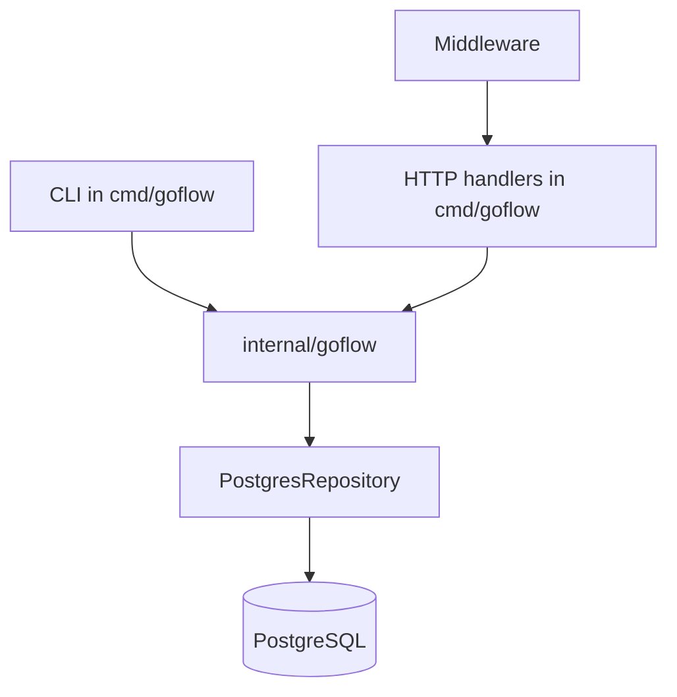

## Day 1 - Module 1.1: Executable Entry Point

### Design impact

- Started with one executable under `cmd/goflow`.
- Kept the app intentionally flat to focus on packages, modules, and the Go toolchain.

### Diagram

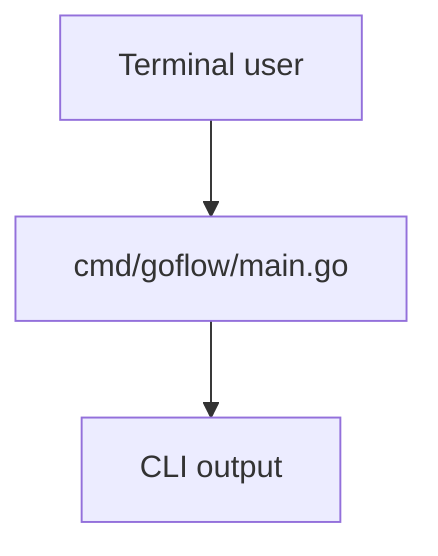

## Day 2 - Module 1.2: Language Practice in `main.go`

### Design impact

- Kept small practice helpers local to `main.go`.
- Deferred package separation until responsibilities became real.

### Diagram

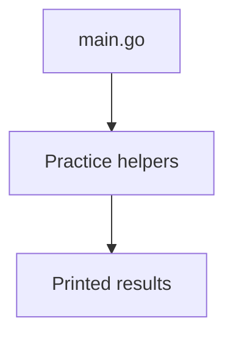

## Day 3 - Module 1.3: In-Memory Store

### Design impact

- Introduced `Job`, `JobStatus`, and `Store`.
- Established the first reusable domain and storage boundary.

### Diagram

```mermaid
flowchart TD
    CLI[CLI command] --> Store[Store]
    Store --> JobsMap[(map[string]Job)]
    Store --> ListSlice[[[]Job]]
```

## Day 4 - Module 1.4: Job Behavior and Small Interfaces

### Design impact

- Moved behavior onto `Job` with methods like `CanRetry()` and `MarkRunning()`.
- Added orchestration with a small consumer-defined interface.

### Diagram

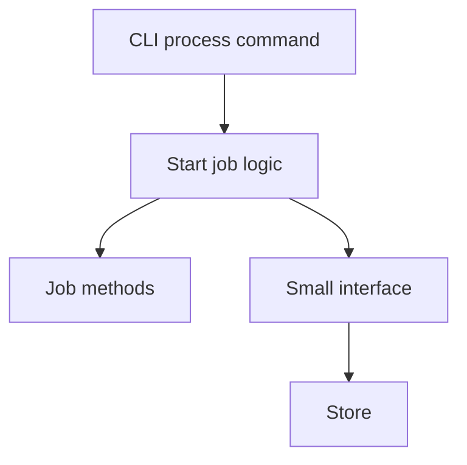

## Day 5 - Module 1.5: Explicit Error Model

### Design impact

- Replaced boolean-style failures with explicit errors.
- Added sentinel errors and a custom typed error for invalid state transitions.

### Diagram

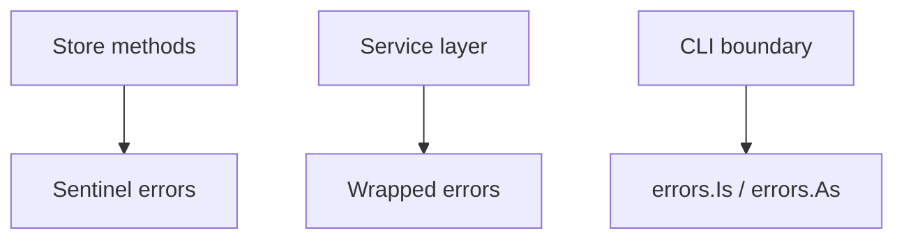

## Day 6 - Module 1.6: JSON File Persistence

### Design impact

- Added `saveJobs(...)`, `loadJobs(...)`, `Store.Save(...)`, and `LoadStore(...)`.
- Moved from ephemeral CLI behavior to persisted local state in `jobs.json`.

### Diagram

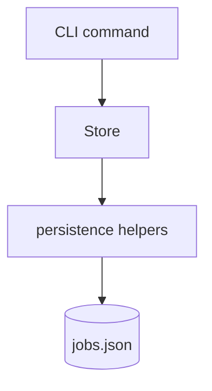

## Day 7 - Module 2.1: First HTTP API

### Design impact

- Added the first `net/http` transport layer.
- Reused the same job model and store behavior across CLI and HTTP.

### Diagram

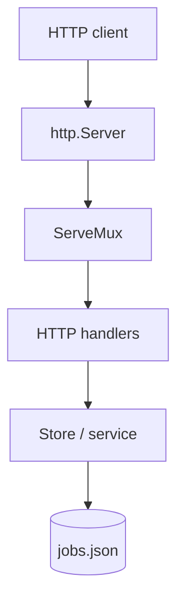

## Day 8 - Module 2.2: Middleware and Reliability Guards

### Design impact

- Added a distinct middleware layer.
- Centralized request IDs, recovery, body limits, and JSON content-type enforcement.

### Diagram

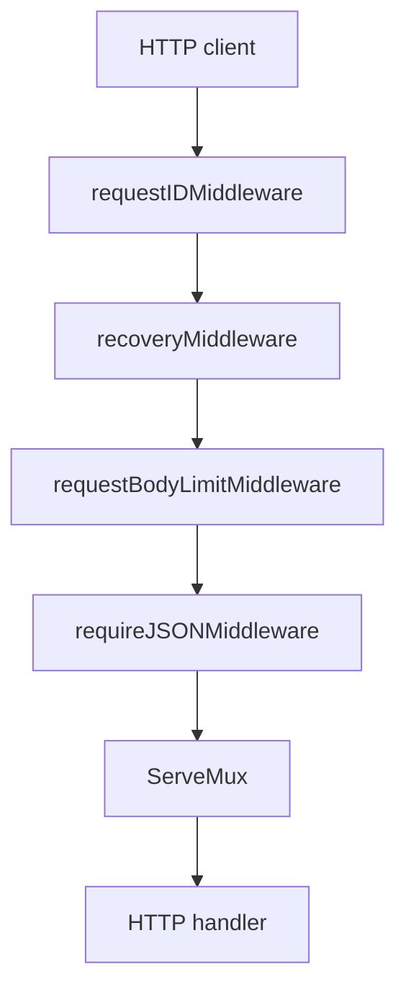

## Day 9 - Module 2.3: Core Package Extraction

### Design impact

- Extracted reusable application logic into `internal/goflow`.
- Corrected dependency direction so CLI and HTTP depend on the core package rather than the reverse.

### Diagram

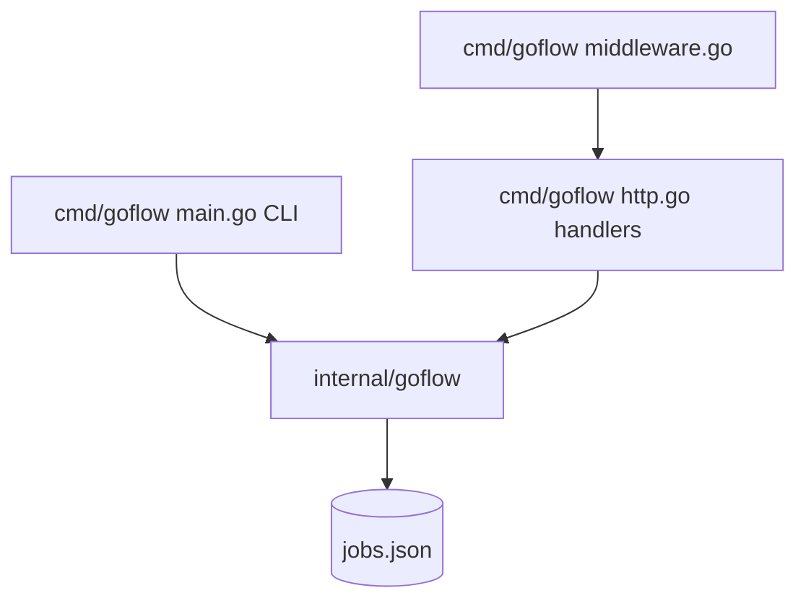

### Flow

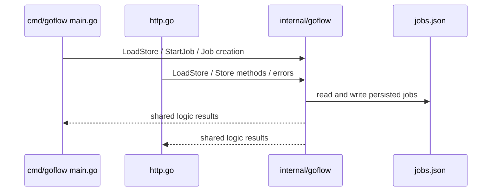

## Day 10 - Module 2.4: PostgreSQL Runtime Switch

### Goal

Replace the old file-based runtime path with PostgreSQL while keeping the higher-level service boundary clean.

### Design change

- Added `cmd/goflow/database.go` for database startup helpers.
- Added the PostgreSQL driver dependency with `github.com/lib/pq`.
- Added `openPostgresStore(...)` to read `DATABASE_URL`, open `*sql.DB`, configure pooling, run `PingContext(...)`, and apply the first migration.
- Switched CLI commands from `LoadStore(jobs.json)` to the PostgreSQL-backed repository.
- Switched HTTP handlers from file reloads to one shared store dependency.
- Updated `StartJob(...)` to use `context.Context` and the shared `JobStore` abstraction.
- Replaced sequential ID generation with random ID generation.

### Diagram

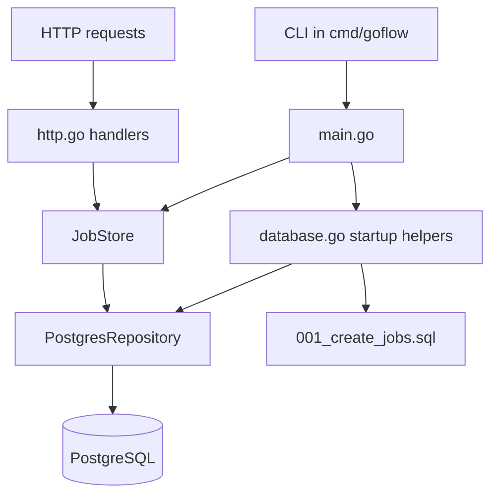

### Flow

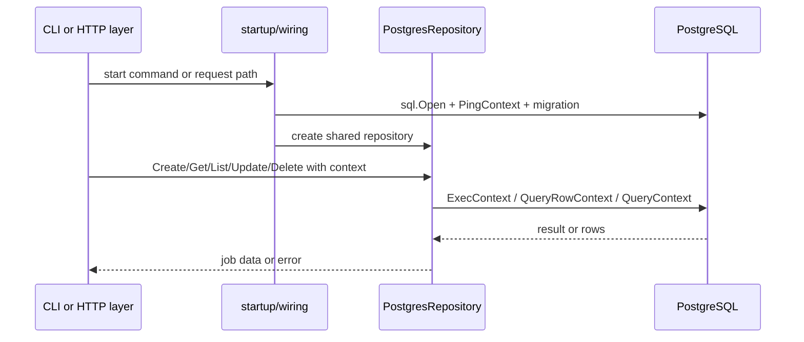

### Why this matters

- The app now targets a real relational persistence boundary.
- The service layer still depends on a store abstraction instead of SQL details.
- HTTP request context can flow into DB work.
- Startup owns connectivity checks and schema setup instead of handlers.

## Known Current Limitations

- Runtime validation against a live PostgreSQL instance has not been completed in this environment because `DATABASE_URL` is unset and no local database is running.
- The current schema still uses `BYTEA` for `payload`, which is simpler than the roadmap's suggested `JSONB` shape.
- Docker is installed, but Docker Desktop is not running here, so a local PostgreSQL container could not be started for validation.
- There are still no automated tests covering the PostgreSQL repository or handler integration paths.
- Content-type validation is still strict and does not yet allow variants like `application/json; charset=utf-8`.

## Related Documents

- `docs/tracker.md`
- `docs/learning.md`
- `docs/session-log.md`
- `docs/decisions.md`
