# GoFlow Design

## Purpose

This document records the design of the GoFlow project as it evolved through the roadmap.
It is organized day by day so architectural changes, boundary decisions, and design trade-offs are easy to review later.
The latest completed day appears at the end.

## Design Principles

- Keep the external behavior simple while the internal architecture is still being learned.
- Separate transport concerns, business rules, persistence, and cross-cutting reliability concerns.
- Prefer the standard library first so the underlying Go model stays visible.
- Keep interfaces small and define them where they are consumed.
- Add reliability protections at the HTTP boundary instead of duplicating them across handlers.
- Accept temporary learning-stage design shortcuts only when they are clearly documented and easy to replace later.

## Current Architecture Snapshot

### Layer Summary

- CLI layer: command dispatch in `main.go` for local job operations.
- HTTP transport layer: handlers in `http.go` exposed through `net/http`.
- Middleware layer: request IDs, panic recovery, request body limits, and content-type enforcement in `middleware.go`.
- Service layer: orchestration and state-transition rules in `service.go`.
- Domain layer: `Job`, `JobStatus`, and job methods in `store.go` and `job.go`.
- Persistence layer: JSON-file persistence helpers in `persistence.go` plus in-memory map storage through `Store`.

### File Ownership

- `cmd/goflow/main.go`: process entry point, CLI dispatch, HTTP server setup, and middleware wiring.
- `cmd/goflow/http.go`: HTTP handlers, request decoding, JSON responses, and API error envelopes.
- `cmd/goflow/middleware.go`: reusable HTTP middleware and middleware chaining.
- `cmd/goflow/store.go`: `Job`, `JobStatus`, `Store`, persistence-facing store methods, and error sentinels.
- `cmd/goflow/job.go`: job behavior such as retry checks and state mutation helpers.
- `cmd/goflow/service.go`: orchestration rules like `startJob(...)`.
- `cmd/goflow/persistence.go`: JSON file load/save helpers for `jobs.json`.
- `jobs.json`: current local durable job state for the learning-stage implementation.

### Current Capability Map

#### CLI Commands

- `create`: create and persist a job.
- `list`: list persisted jobs.
- `get`: fetch one persisted job.
- `process`: transition a pending job to running.
- `serve`: start the HTTP server.

#### HTTP Endpoints

- `GET /health/live`: liveness check.
- `GET /v1/jobs`: list jobs.
- `GET /v1/jobs/{id}`: fetch one job.
- `POST /v1/jobs`: create a job.

#### Middleware

- `requestIDMiddleware`: attaches `X-Request-ID` and stores the same value in request context.
- `recoveryMiddleware`: converts panics into structured JSON `500` responses.
- `requestBodyLimitMiddleware(1<<20)`: limits request bodies to 1 MiB.
- `requireJSONMiddleware`: enforces `application/json` on `POST` requests.

### High-Level Diagram

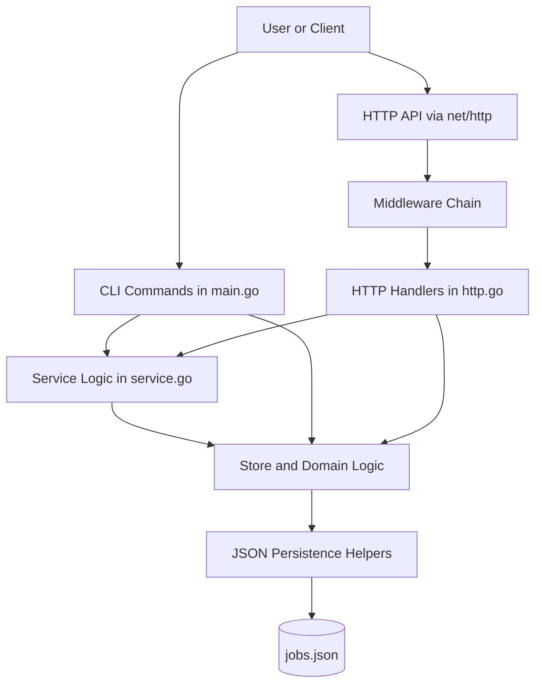

## Day 1: Environment and Executable Entry Point

### What Changed

Day 1 established GoFlow as a runnable Go module with a `package main` entry point and a small CLI scaffold.

### Design Decisions

#### Why Start with `cmd/goflow`

The project started with one executable under `cmd/goflow` so the learner could clearly see:
- where execution begins
- how Go modules and packages relate
- how CLI arguments reach the program

#### Why Keep the First CLI Small

A tiny command dispatcher kept the design focused on:
- module layout
- the Go toolchain
- executable structure

without prematurely introducing architecture layers.

### Day 1 Architecture Impact

- Created the first executable boundary.
- Established `main.go` as the entry point.
- Kept the design intentionally flat while the learner built Go fundamentals.

### Day 1 Diagram

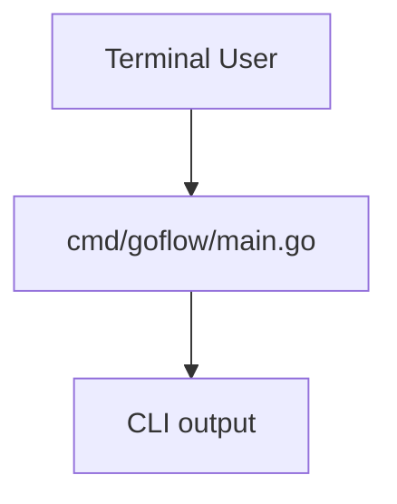

### Day 1 Flow

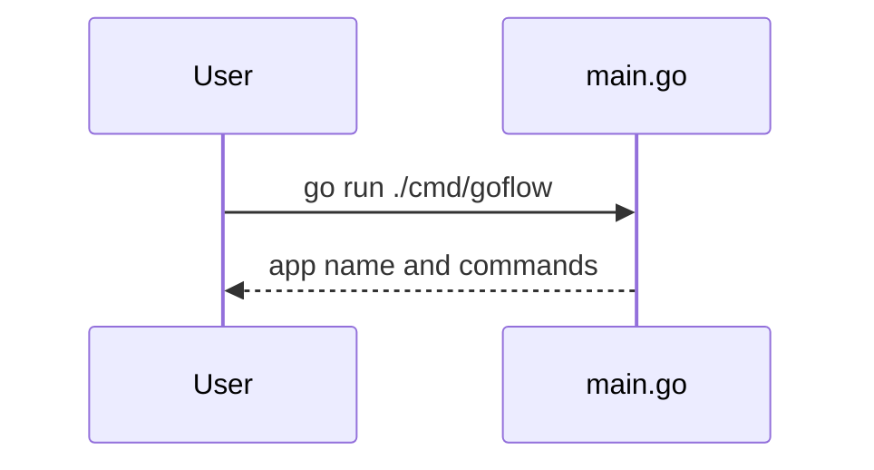

## Day 2: Language Fundamentals in Place

### What Changed

Day 2 added core language-practice helpers directly in `main.go`.

### Design Decisions

#### Why Keep Practice Functions in `main.go` Temporarily

The goal was learning syntax and control flow, not immediate architecture purity.
The practice helpers stayed local because:
- they were teaching tools
- they were not yet stable domain abstractions
- moving them too early would have added package complexity before the learner understood the basics

### Day 2 Architecture Impact

- No major boundary change.
- Reinforced the decision to defer package splitting until responsibilities were clearer.

### Day 2 Diagram

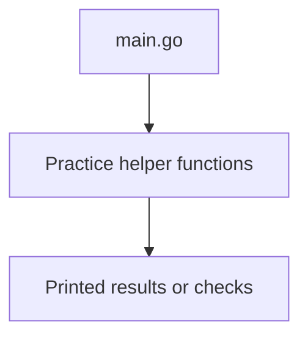

### Day 2 Flow

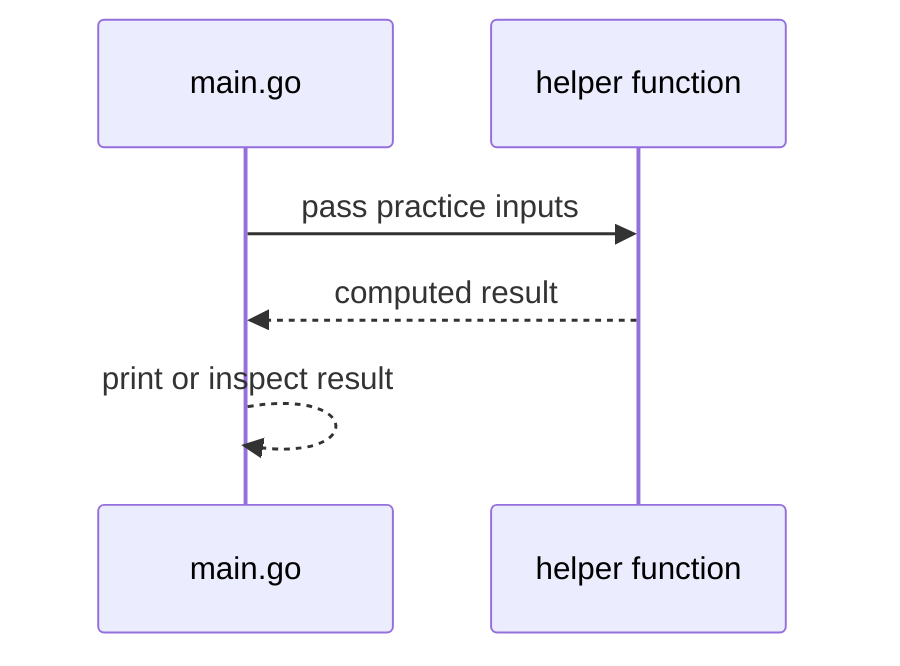

## Day 3: In-Memory Job Store

### What Changed

Day 3 introduced the first actual GoFlow domain model with `Job`, `JobStatus`, and `Store`.

### Why an In-Memory Store First

An in-memory map-backed store was chosen because it exposes core Go data-structure behavior directly:
- slices for returned lists
- maps for keyed lookup
- value semantics for returned structs

This kept persistence and external dependencies out of the picture while the learner focused on core collection behavior.

### Store Design

The `Store` type owns a `map[string]Job` and exposes:
- `Create`
- `Get`
- `List`
- `Update`
- `Delete`

### Day 3 Architecture Impact

- Introduced a durable domain boundary around jobs and storage operations.
- Created the first real separation between CLI flow and reusable job-storage logic.
- Established a map-backed implementation that later persistence layers could reuse or replace.

### Day 3 Diagram

```mermaid
flowchart TD
    CLI[CLI command] --> Store[Store]
    Store --> JobsMap[(map[string]Job)]
    Store --> ListSlice[[[]Job]]
```

### Day 3 Flow

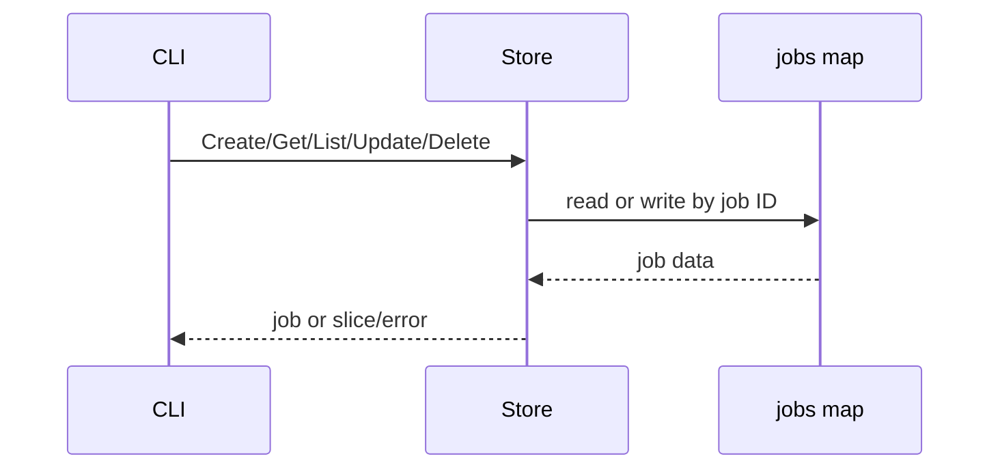

## Day 4: Job Behavior and Small Interfaces

### What Changed

Day 4 moved behavior closer to the job model and introduced a small orchestration function using consumer-defined interfaces.

### Why Methods on `Job`

Methods such as `CanRetry()` and `MarkRunning()` were placed on `Job` because the behavior belongs to the data.
This keeps state-related logic near the state it reasons about.

### Why Small Interfaces

The first service-style orchestration used a small interface instead of a broad store abstraction.
This follows the Go design habit of defining interfaces where they are consumed and keeping them narrow.

### Day 4 Architecture Impact

- Added a first service-style orchestration boundary in `service.go`.
- Clarified the split between domain behavior (`job.go`), orchestration (`service.go`), and storage (`store.go`).

### Day 4 Diagram

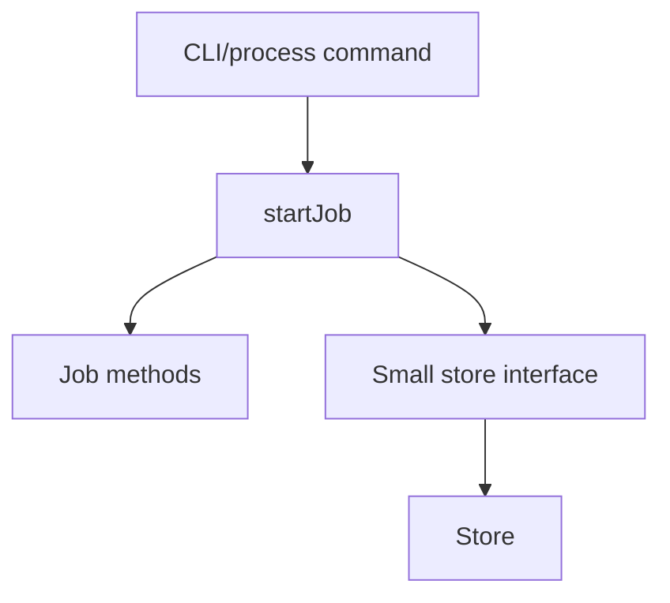

### Day 4 Flow

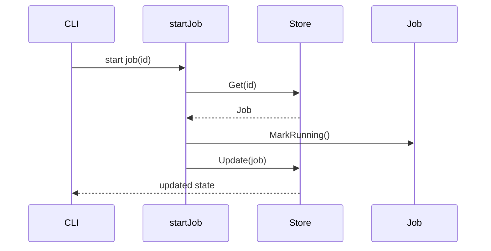

## Day 5: Explicit Error Model

### What Changed

Day 5 replaced boolean-style failures with explicit errors and added one custom typed error.

### Why Sentinel Errors

`ErrJobNotFound` and `ErrJobAlreadyExists` were introduced as sentinel errors because callers only needed to recognize a stable yes/no condition.

### Why One Custom Error Type

`InvalidJobStatusError` was added because state-transition failures carry extra structured meaning:
- which job failed
- what its current status was

That is richer than a simple not-found style condition.

### Day 5 Architecture Impact

- Store methods now return errors instead of booleans.
- `service.go` wraps lower-level failures with context.
- CLI boundaries decide how to present user-facing messages using `errors.Is(...)` and later `errors.As(...)`.

### Day 5 Diagram

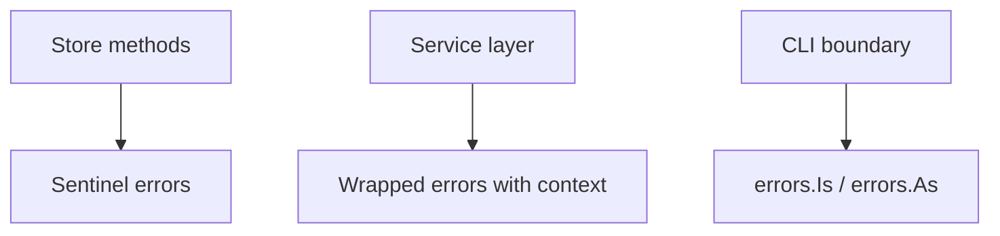

### Day 5 Flow

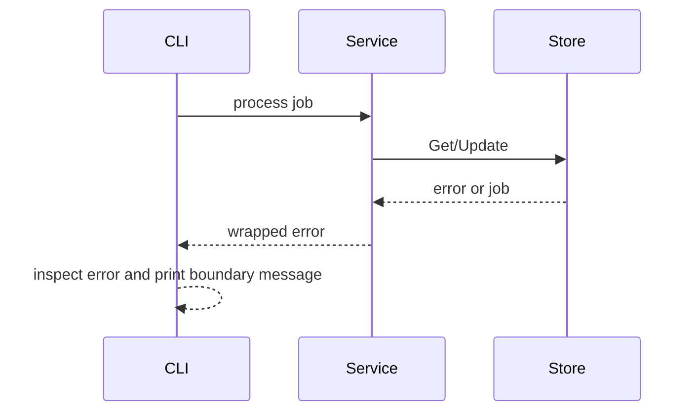

## Day 6: JSON File Persistence

### What Changed

Day 6 introduced JSON-file persistence through `jobs.json` and connected the CLI commands to durable state.

### Why File Persistence First

JSON-file persistence was chosen because it is the smallest real persistence step between:
- in-memory learning code
- future database-backed storage

It teaches:
- file I/O
- serialization boundaries
- schema compatibility concerns

without adding database setup overhead yet.

### Persistence Design

- `saveJobs(...)` converts `[]Job` into JSON and writes it to disk.
- `loadJobs(...)` reads JSON and recreates `[]Job`.
- `Store.Save(...)` and `LoadStore(...)` bridge between the store and file persistence.

### Why Missing File Is Not an Error

A missing `jobs.json` file is treated as an empty job list, not a failure.
That decision reflects startup reality in a local-first persistence phase.

### Day 6 Architecture Impact

- Added a persistence layer under the store.
- Changed CLI commands from ephemeral operations to durable state transitions.
- Introduced the first compatibility risk around serialized field names.

### Day 6 Diagram

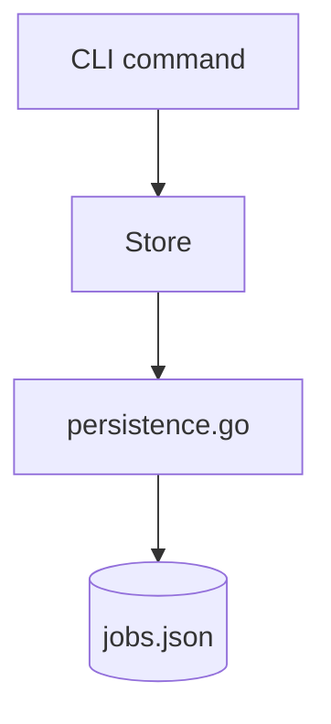

### Day 6 Flow

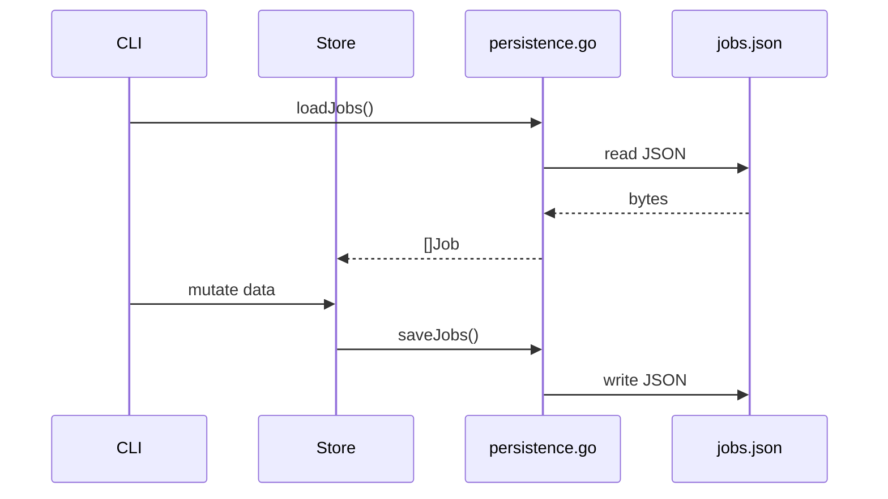

## Day 7: First HTTP API

### What Changed

Day 7 added the first `net/http` API surface on top of the existing store and persistence layers.

### Why `net/http` First

The standard library was used directly so the learner could understand:
- handlers
- mux routing
- request and response objects
- method dispatch

without hiding the model behind a framework.

### HTTP Design

The API now exposes:
- `GET /health/live`
- `GET /v1/jobs`
- `GET /v1/jobs/{id}`
- `POST /v1/jobs`

### Why Structured JSON Errors

The API introduced a stable error envelope so clients can depend on:
- HTTP status codes for broad protocol meaning
- JSON error codes for precise application meaning

### Day 7 Architecture Impact

- Added an HTTP transport layer in `http.go`.
- Preserved the existing store and service logic instead of duplicating business rules.
- Showed how one domain model can serve both CLI and HTTP boundaries.

### Day 7 Diagram

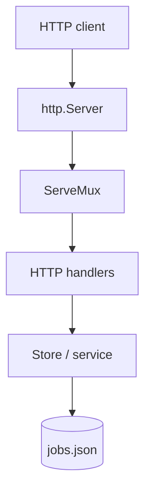

### Day 7 Flow

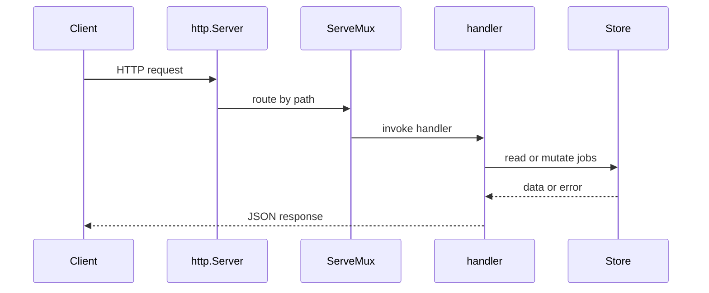

## Day 8: Middleware and Reliability Guards

### What Changed

Day 8 added the first middleware stack and reliability protections around the HTTP API.

### Why Middleware Now

By Day 7, handlers worked, but cross-cutting HTTP concerns were beginning to appear:
- request identity
- panic recovery
- body limits
- content-type validation

Middleware is the correct place for those concerns because they are shared transport rules, not per-handler business logic.

### Middleware Design

#### `requestIDMiddleware`

This middleware:
- generates a request ID
- returns it in `X-Request-ID`
- stores it in request context for downstream server-side use

#### `recoveryMiddleware`

This middleware contains unexpected panics and converts them into structured JSON `500` responses.
It does not replace normal error handling.

#### `requestBodyLimitMiddleware(1<<20)`

This middleware constrains body size centrally so handlers do not each need to reimplement size protection.

#### `requireJSONMiddleware`

This middleware enforces `application/json` for `POST` requests.
It makes the API contract strict and predictable.

### Why `REQUEST_BODY_TOO_LARGE` Was Added

At first, oversized request bodies still surfaced as generic invalid-body errors.
The design was refined to check `*http.MaxBytesError` explicitly so the API can distinguish:
- malformed JSON
- body too large

### Day 8 Architecture Impact

- Added a distinct middleware layer in `middleware.go`.
- Moved more reliability concerns to the HTTP boundary.
- Introduced request-scoped context values as a design tool for later logging and tracing.

### Day 8 Diagram

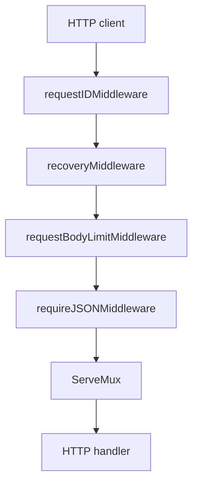

### Day 8 Flow

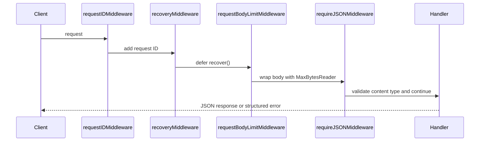

## Known Current Limitations

- The project still lives in `package main`; cleaner package boundaries are deferred to the next architecture module.
- `jobs.json` remains a local learning-stage store, not a multi-process-safe persistence layer.
- Job ID generation is still based on `len(store.List())+1`, which is not production-safe.
- Content-type validation is currently strict and does not yet allow valid variants like `application/json; charset=utf-8`.
- Middleware is still applied as one shared chain rather than being selectively composed per route.

## Related Documents

- `docs/tracker.md`
- `docs/learning.md`
- `docs/session-log.md`
- `docs/decisions.md`
