# GoFlow System Design

GoFlow is an asynchronous job-processing service written in Go. It accepts jobs through an HTTP API or CLI, stores job state in PostgreSQL, and processes ready jobs through a bounded worker pool. The design prioritizes clear boundaries, explicit failure handling, safe shutdown, and operational visibility while keeping the implementation understandable and dependency-light.

## Design Goals

- Provide a small but production-shaped job-processing backend.
- Keep the runtime model explicit: API submits jobs, PostgreSQL stores state, workers process jobs.
- Use Go standard-library primitives where they are sufficient.
- Keep HTTP, service, worker, and persistence responsibilities separate.
- Make job ownership safe with an atomic database claim.
- Preserve enough operational data to inspect failures, retries, and dead-letter jobs.
- Support local and containerized execution with the same binary.
- Keep deployment validation repeatable through tests, Docker, Compose, and CI.

## Non-Goals

- Exactly-once external side effects.
- Public internet exposure without authentication and authorization.
- Distributed metrics aggregation.
- A full message broker replacement.
- Complex multi-service deployment.
- Framework-driven routing or dependency injection.

## System Overview

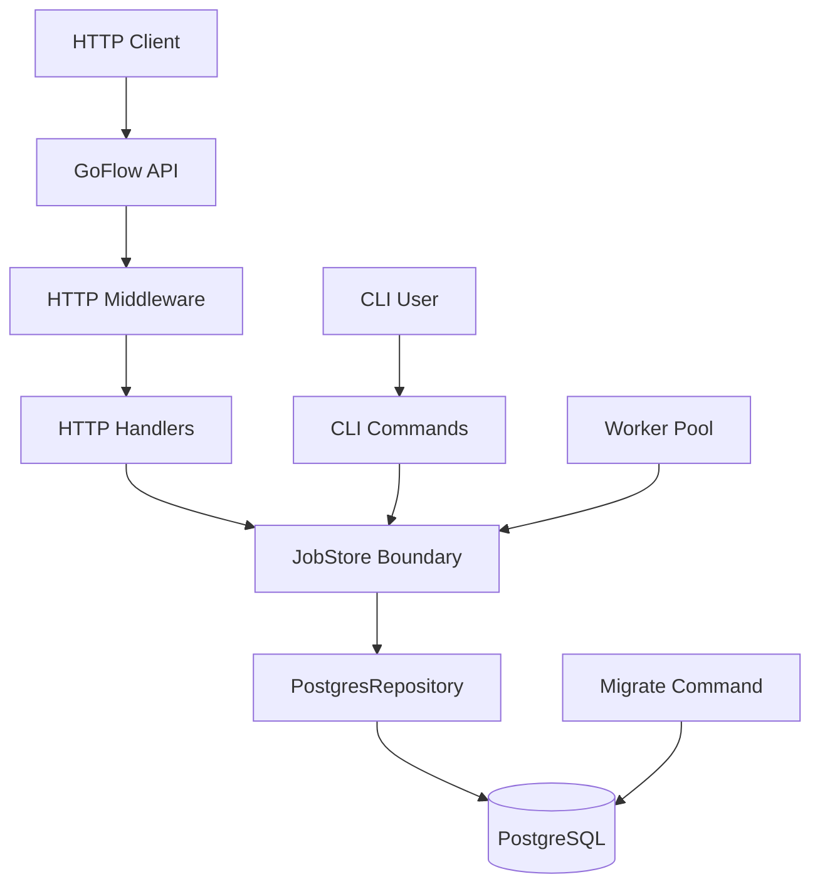

GoFlow is built as one binary with several commands. The `serve` command runs the API, the `work` command runs the worker pool, and the `migrate` command owns schema setup. CLI commands reuse the same storage boundary for direct local operations.

## Runtime Commands

| Command | Responsibility |
|---|---|
| `serve` | Starts the HTTP API, middleware chain, health endpoints, metrics endpoint, and graceful HTTP shutdown. |
| `work` | Starts the poller, bounded queue, worker pool, job execution flow, retry handling, and graceful worker shutdown. |
| `migrate` | Applies the SQL migration file to PostgreSQL. |
| `create <type>` | Creates a job from the terminal. |
| `list` | Lists persisted jobs. |
| `get <job-id>` | Reads a single persisted job. |
| `process <job-id>` | Manually claims a job as running. |

## Package And File Responsibilities

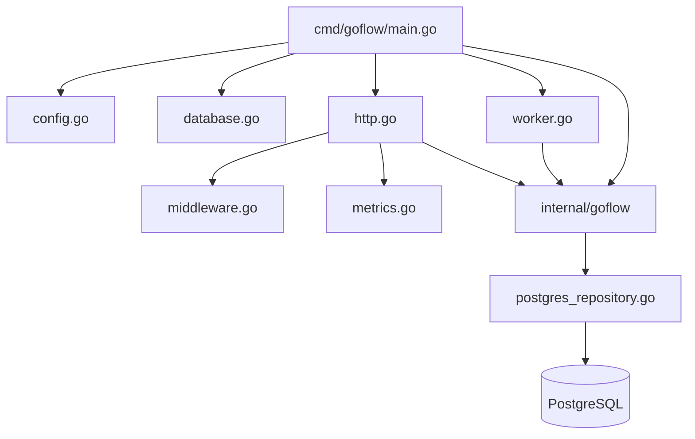

### Executable Layer: `cmd/goflow`

| File | Design Role |
|---|---|
| `main.go` | Process entry point, command dispatch, dependency construction, signal handling, HTTP server lifecycle, worker lifecycle. |
| `config.go` | Reads environment variables once and provides validated runtime configuration. |
| `database.go` | Opens PostgreSQL, configures the repository, applies migrations, and generates job IDs. |
| `http.go` | Translates HTTP requests into store operations and translates results/errors into JSON responses. |
| `middleware.go` | Adds request IDs, request logging, panic recovery, request body limits, and JSON content-type enforcement. |
| `metrics.go` | Maintains in-process counters, gauges, and duration buckets behind a mutex. |
| `worker.go` | Owns single-job execution behavior and maps executor results into completion, retry, or dead-letter transitions. |

### Core Layer: `internal/goflow`

| File | Design Role |
|---|---|
| `store.go` | Defines `Job`, `JobStatus`, sentinel errors, and a legacy in-memory store implementation. |
| `job.go` | Contains domain behavior and typed domain errors such as invalid status transitions. |
| `service.go` | Owns business transitions: start/claim, complete, fail, retry, and dead-letter. |
| `postgres_repository.go` | Implements persistence with `database/sql`, parameterized SQL, scanning, and atomic claim behavior. |

## Dependency Direction

The dependency direction is intentionally one-way:

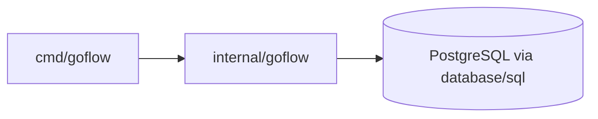

The runtime layer knows how to serve HTTP, run workers, log events, load config, and handle process shutdown. The core layer knows job state and persistence behavior. The core layer does not import HTTP or CLI code.

## HTTP API Design

The HTTP layer uses `net/http` and `http.ServeMux`. Handlers are grouped by endpoint shape:

| Endpoint | Handler Responsibility |
|---|---|
| `GET /health/live` | Confirms the process can respond. |
| `GET /health/ready` | Confirms PostgreSQL is reachable. |
| `GET /metrics` | Returns an in-process metrics snapshot. |
| `GET /v1/jobs` | Lists jobs, optionally filtered by status. |
| `POST /v1/jobs` | Validates request JSON and creates a pending job. |
| `GET /v1/jobs/{id}` | Validates job ID and returns one job. |
| `DELETE /v1/jobs/{id}` | Validates job ID and deletes one job. |

### HTTP Request Flow

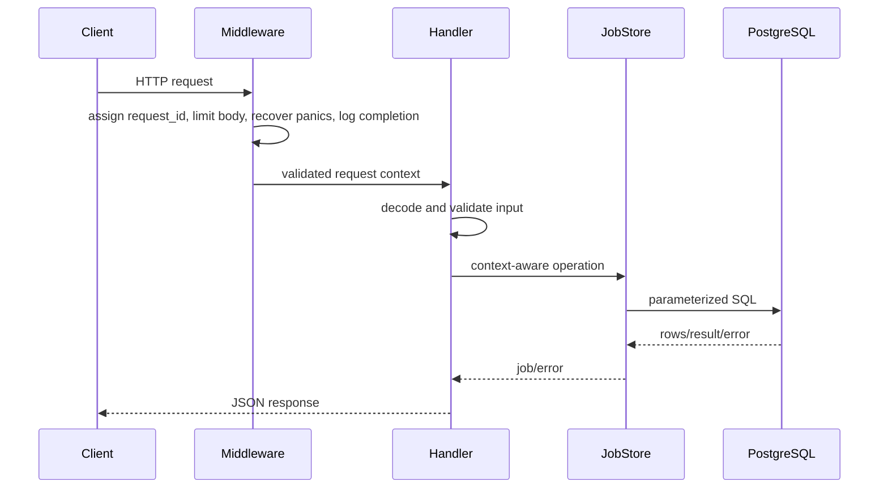

### API Error Model

HTTP errors use a consistent envelope:

```json
{
  "error": {
    "code": "JOB_NOT_FOUND",
    "message": "The requested job does not exist"
  }
}
```

The HTTP status code communicates protocol-level meaning. The JSON error code communicates application-level meaning. Internal database errors are not exposed directly to clients.

## Middleware Design

Middleware wraps the mux in a fixed order:

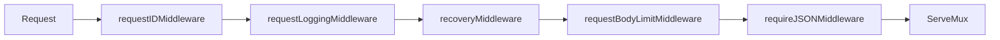

| Middleware | Purpose |
|---|---|
| Request ID | Adds a unique request identifier to the context and response header. |
| Request logging | Logs method, path, status, request ID, and duration. |
| Recovery | Converts panics into controlled `500` JSON errors. |
| Body limit | Caps request bodies at 1 MB. |
| JSON content type | Requires JSON content type for `POST` requests. |

## Data Model

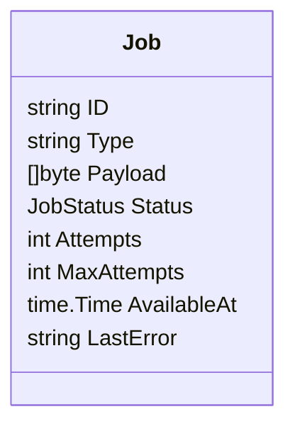

| Field | Purpose |
|---|---|
| `ID` | Stable job identifier. |
| `Type` | Job category such as `email` or `report`. |
| `Payload` | Optional binary payload. |
| `Status` | Current state: `pending`, `running`, `completed`, or `dead_letter`. |
| `Attempts` | Number of execution attempts already made. |
| `MaxAttempts` | Retry budget. |
| `AvailableAt` | Earliest time a pending job can be picked up. |
| `LastError` | Last recorded execution error. |

## Persistence Design

PostgreSQL is the source of truth for job state. The repository uses `database/sql` with context-aware methods and parameterized queries.

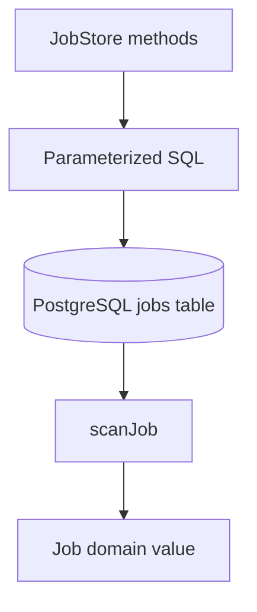

### Repository Operations

| Operation | SQL Behavior |
|---|---|
| `Create` | Inserts a new job and maps duplicate primary key errors to `ErrJobAlreadyExists`. |
| `Get` | Reads one job by ID and maps missing rows to `ErrJobNotFound`. |
| `List` | Reads all jobs ordered by creation time and ID. |
| `ListReadyJobs` | Reads pending jobs where `available_at <= NOW()`. |
| `ClaimPending` | Atomically changes one pending job to running. |
| `Update` | Persists a full job state update. |
| `Delete` | Deletes one job by ID. |
| `Ping` | Checks PostgreSQL readiness. |

### Atomic Claim

The ownership boundary is the database, not the in-memory queue.

```sql
UPDATE jobs
SET status = 'running', updated_at = NOW()
WHERE id = $1
AND status = 'pending';
```

If one row is affected, the worker owns the job. If zero rows are affected, the job was missing or no longer pending. The service reloads the job only to translate that result into the correct domain error.

## Job State Machine

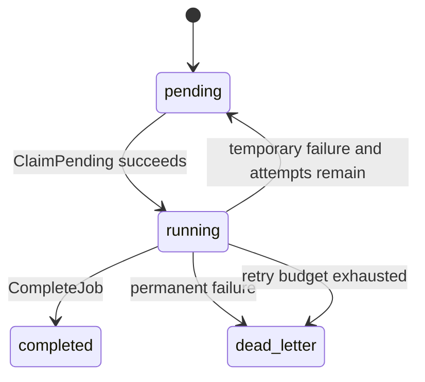

### State Rules

| Transition | Owner | Rule |
|---|---|---|
| `pending -> running` | `StartJob` + `ClaimPending` | Only a pending job can be claimed. |
| `running -> completed` | `CompleteJob` | Only a running job can complete. |
| `running -> pending` | `FailJob` | Temporary failure with retry budget remaining. |
| `running -> dead_letter` | `FailJob` | Permanent failure or exhausted retry budget. |

## Worker Design

The worker command has three moving parts:

1. Poller: periodically asks PostgreSQL for ready pending jobs.
2. Queue: bounded channel of job IDs.
3. Workers: fixed number of goroutines that claim and process jobs.

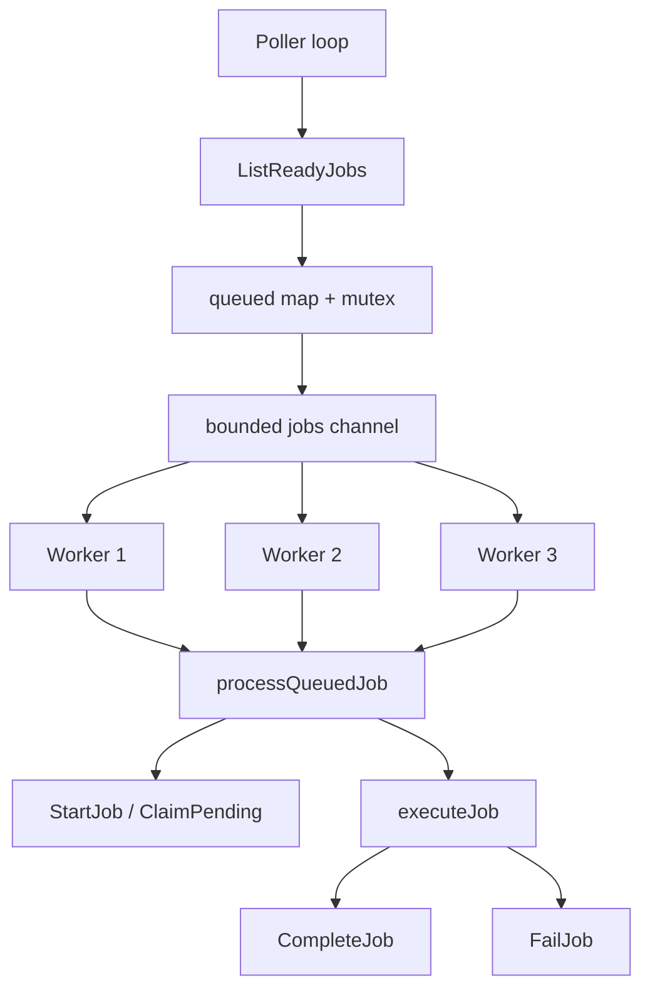

### Worker Settings

| Setting | Current Value | Reason |
|---|---:|---|
| Worker count | `3` | Bounded concurrency and simple local debugging. |
| Queue size | `8` | Allows a small backlog while still applying backpressure. |
| Poll interval | `2s` | Keeps polling simple without busy-looping. |

### Queue And Backpressure

The queue is a bounded channel. The poller can enqueue a small number of ready jobs without blocking, but once the buffer fills, enqueueing blocks until workers receive jobs. This prevents unbounded in-memory growth.

The `queued` map reduces repeated enqueueing inside one worker process. It is protected by a mutex because the poller and workers both access it.

### Worker Execution Flow

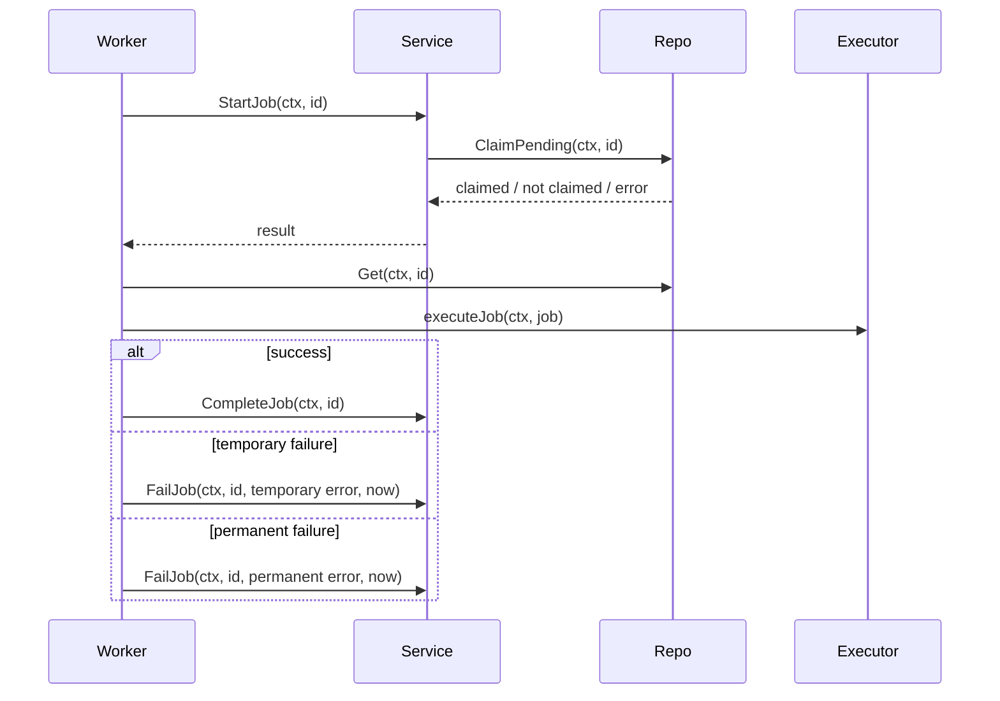

## Retry And Dead-Letter Design

Retry information is persisted in the same `jobs` table.

| Field | Role In Retry |
|---|---|
| `attempts` | Counts failed execution attempts. |
| `max_attempts` | Caps retry attempts. |
| `available_at` | Schedules the next retry time. |
| `last_error` | Stores the latest failure reason. |
| `status` | Determines whether the job is eligible, running, completed, or dead-lettered. |

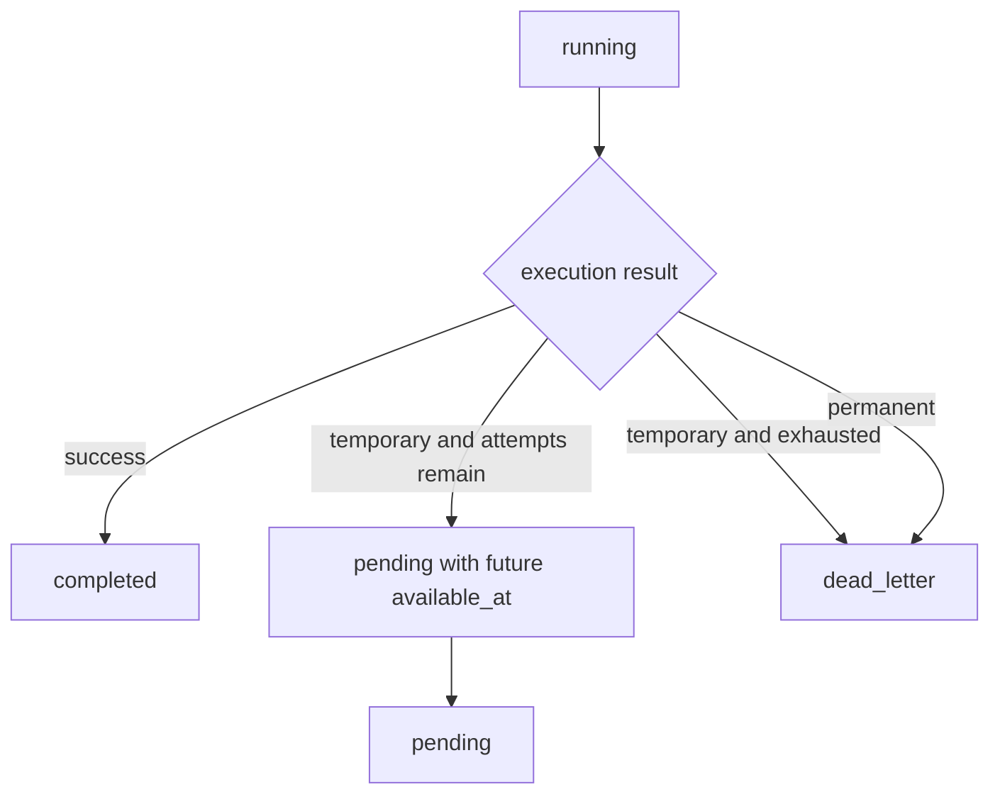

Workers do not sleep while holding failed jobs. Instead, `FailJob` updates `available_at`; later polling picks the job when it becomes ready.

## Context And Shutdown Design

GoFlow uses command-owned contexts for long-running processes.

### HTTP Shutdown

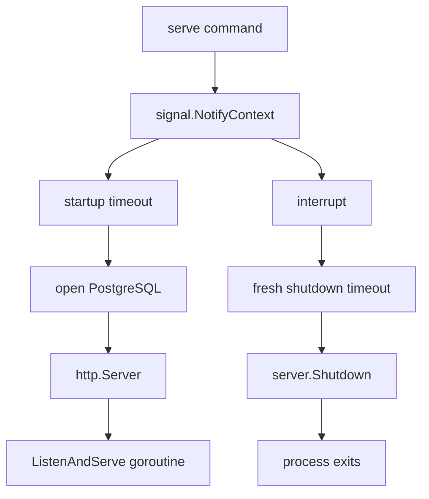

The HTTP server stops accepting new requests and gives active requests a bounded shutdown window.

### Worker Shutdown

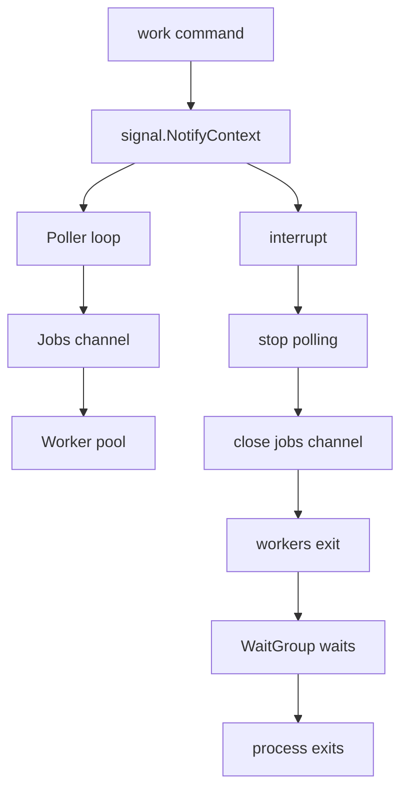

The poller owns closing the jobs channel. Workers exit when the channel closes or when the context is cancelled.

## Observability Design

### Logs

GoFlow uses `log/slog` JSON logs at runtime boundaries.

| Log Source | Important Fields |
|---|---|
| HTTP middleware | `request_id`, `method`, `path`, `status`, `duration_ms` |
| Job creation handler | `request_id`, `job_id`, `job_type` |
| Worker loop | `worker_id`, `job_id`, `error` |

Service and repository layers return errors instead of logging directly. Runtime boundaries decide how to log and present those errors.

### Health

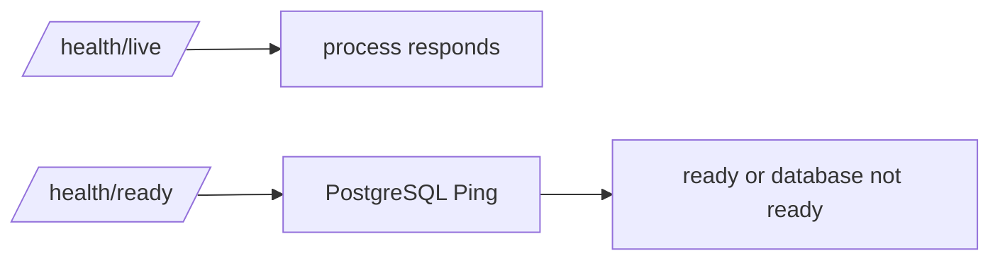

`/health/live` answers whether the process is alive. `/health/ready` answers whether the service can handle real work that depends on PostgreSQL.

### Metrics

The metrics collector is in-process and mutex-protected.

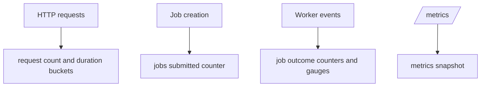

Metrics are process-local. API and worker metrics are not aggregated when they run as separate processes.

## Configuration Design

Configuration is read from environment variables near process startup and passed into setup functions.

| Variable | Requirement | Design Reason |
|---|---|---|
| `DATABASE_URL` | Required | Missing database configuration should fail fast. |
| `HTTP_ADDR` | Optional | Safe operational default of `:8080`. |
| `MIGRATION_FILE` | Optional | Defaults to the bundled migration path. |

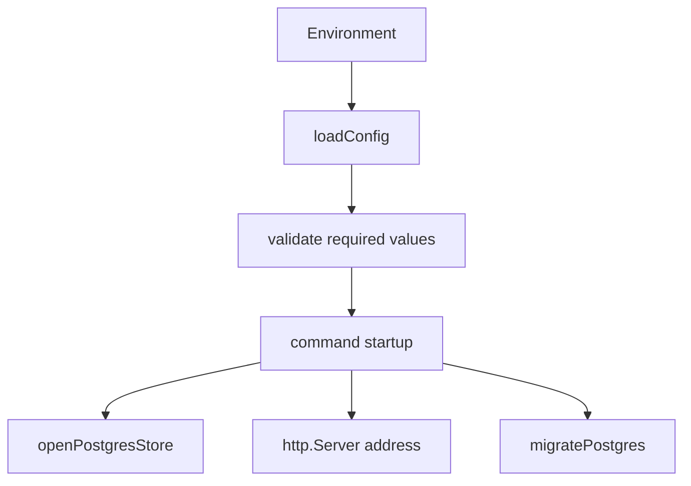

Runtime code receives explicit configuration values instead of reading environment variables deep inside handlers or repositories.

## Deployment Design

### Container Image

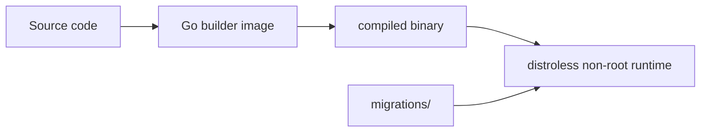

The Dockerfile uses a multi-stage build. The final image contains the compiled binary and migrations, not the Go compiler or source tree.

### Compose Topology

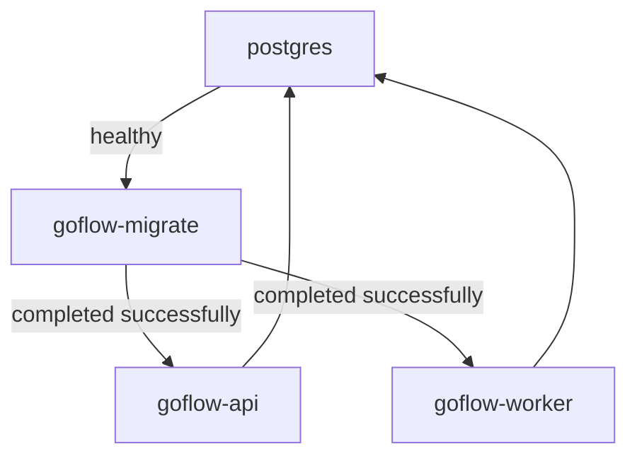

Migrations run as a distinct service before API and worker processes start. This avoids API and worker processes racing to apply schema changes.

## Testing Design

Testing follows the system boundaries.

| Test Type | Files | Purpose |
|---|---|---|
| Handler tests | `cmd/goflow/http_test.go` | Validate HTTP status codes, JSON bodies, input validation, and API errors. |
| Config tests | `cmd/goflow/config_test.go` | Validate environment-based configuration behavior. |
| Metrics tests | `cmd/goflow/metrics_test.go` | Validate counters, gauges, and duration buckets. |
| Worker tests | `cmd/goflow/worker_test.go` | Validate processing success, retry, dead-letter, and cancellation paths. |
| Service tests | `internal/goflow/service_test.go` | Validate business state transitions and error behavior. |
| Repository tests | `internal/goflow/postgres_repository_test.go` | Validate SQL expectations and database error mapping with `sqlmock`. |
| Integration tests | `internal/goflow/postgres_repository_integration_test.go` | Validate repository behavior against a real PostgreSQL database. |
| Benchmarks | `cmd/goflow/metrics_benchmark_test.go` | Measure metrics snapshot performance. |

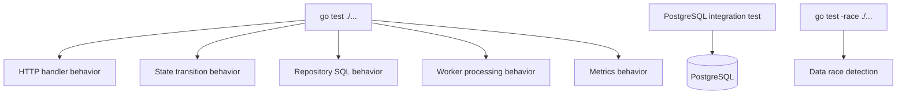

## CI Design

GitHub Actions validates the project from a clean environment.

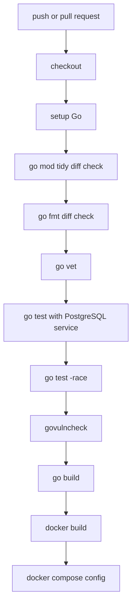

CI protects the main branch from unformatted code, untidy dependencies, test failures, race regressions, known reachable vulnerabilities, broken builds, and invalid container configuration.

## Security Design

| Area | Design Choice |
|---|---|
| SQL injection | Use parameterized SQL only. |
| Input validation | Validate job types, status filters, and job ID format at the HTTP boundary. |
| Request size | Limit request bodies to 1 MB. |
| Timeouts | Configure HTTP read-header, read, write, and idle timeouts. |
| Error exposure | Return safe external errors; do not expose raw database errors. |
| Secrets | Read `DATABASE_URL` from environment; do not log or commit secrets. |
| Logging | Log metadata, not request bodies or payloads. |
| Public exposure | Treat the API as internal until authentication and authorization exist. |

## Consistency Guarantees

GoFlow guarantees atomic ownership of a job claim through PostgreSQL conditional update. It does not guarantee exactly-once external side effects.

| Guarantee | Status |
|---|---|
| One worker can claim a pending job in a successful atomic claim. | Provided by `ClaimPending`. |
| Ready jobs survive process restarts. | Provided by PostgreSQL persistence. |
| Retry schedule survives process restarts. | Provided by `available_at`. |
| Worker shutdown has a cancellation path. | Provided by command-owned context and channel closure. |
| External side effects happen exactly once. | Not guaranteed. Requires idempotent executors. |

## Design Trade-Offs

| Decision | Benefit | Trade-Off |
|---|---|---|
| One binary with multiple commands | Simple build and deployment artifact. | Commands share one executable package. |
| Standard `net/http` | Clear Go-native request handling. | Less routing convenience than a framework. |
| PostgreSQL as queue state | Durable job state and simple local stack. | Polling is less efficient than a dedicated broker at large scale. |
| In-process metrics | Simple and dependency-free. | Metrics are not aggregated across processes. |
| Distroless runtime image | Smaller image and reduced attack surface. | No shell or `curl` inside the container. |
| Dead-letter as status | Simple schema and easy inspection. | No separate replay/audit workflow yet. |
| Fixed worker settings in code | Easy to reason about. | Not runtime configurable yet. |

## Known Limitations

- No authentication or authorization.
- No real external job integrations; job execution is simulated.
- Metrics are process-local.
- No distributed rate limiter.
- No separate dead-letter table or replay workflow.
- No least-privilege PostgreSQL role in the local Compose setup.
- Retry delay has exponential backoff but no jitter yet.
- Worker count, queue size, retry policy, and poll interval are not runtime configurable.
- Exactly-once external execution is not guaranteed.

## Future Design Improvements

- Add authentication and authorization middleware.
- Add Prometheus/OpenTelemetry metrics and traces.
- Add real job executors and idempotency keys.
- Add a separate dead-letter table and replay tooling.
- Add least-privilege database roles.
- Make worker count, queue size, retry policy, and poll interval configurable.
- Add retry jitter and maximum retry delay.
- Add production-ready rate limiting.
- Add deployment examples for managed PostgreSQL and container platforms.
