# GoFlow Design

## Purpose

This document records how GoFlow's design evolved across the roadmap. It is organized day by day so changes in architecture, boundaries, and trade-offs stay easy to review.

## Design Principles

- Keep external behavior simple while the internal architecture is still being learned.
- Separate transport, business rules, persistence, and cross-cutting reliability concerns.
- Prefer the standard library first so the Go model stays visible.
- Keep interfaces small and define them where they are consumed.
- Add reliability protections at the HTTP boundary instead of duplicating them in handlers.
- Accept temporary learning-stage shortcuts only when they are clearly documented and easy to replace.

## Current Architecture Snapshot

### Layer Summary

- CLI layer: command dispatch in `cmd/goflow/main.go`.
- HTTP transport layer: handlers in `cmd/goflow/http.go`.
- Middleware layer: request IDs, panic recovery, request body limits, and content-type enforcement in `cmd/goflow/middleware.go`.
- Core domain layer: `Job`, `JobStatus`, store logic, persistence helpers, service orchestration, and repository contracts in `internal/goflow`.
- Persistence layer: PostgreSQL-backed repository access through `database/sql` plus the initial SQL migration; `jobs.json` is now legacy learning-stage data rather than the active runtime store.

### Current High-Level Diagram

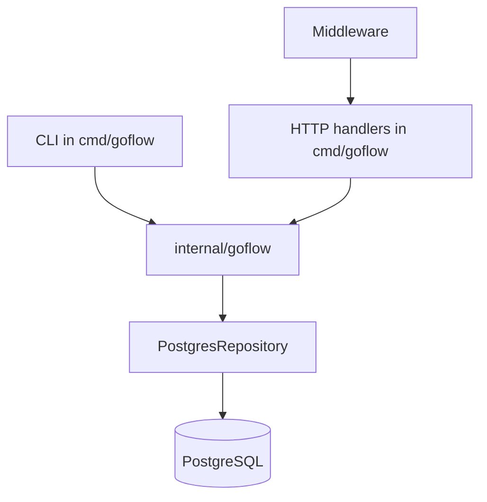

## Day 1 - Module 1.1: Executable Entry Point

### Design impact

- Started with one executable under `cmd/goflow`.
- Kept the app intentionally flat to focus on packages, modules, and the Go toolchain.

### Diagram

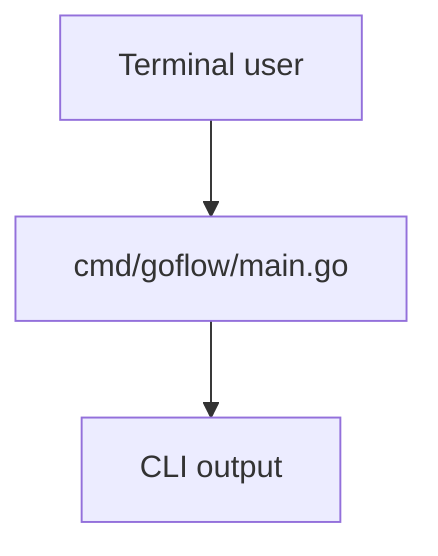

## Day 2 - Module 1.2: Language Practice in `main.go`

### Design impact

- Kept small practice helpers local to `main.go`.
- Deferred package separation until responsibilities became real.

### Diagram

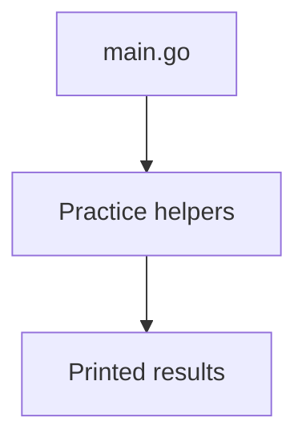

## Day 3 - Module 1.3: In-Memory Store

### Design impact

- Introduced `Job`, `JobStatus`, and `Store`.
- Established the first reusable domain and storage boundary.

### Diagram

```mermaid
flowchart TD
    CLI[CLI command] --> Store[Store]
    Store --> JobsMap[(map[string]Job)]
    Store --> ListSlice[[[]Job]]
```

## Day 4 - Module 1.4: Job Behavior and Small Interfaces

### Design impact

- Moved behavior onto `Job` with methods like `CanRetry()` and `MarkRunning()`.
- Added orchestration with a small consumer-defined interface.

### Diagram

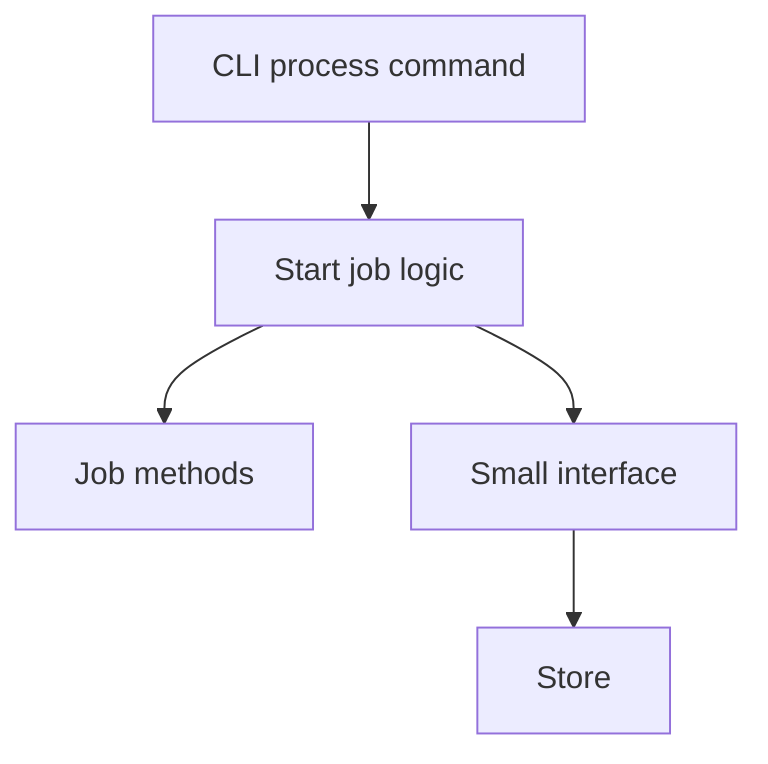

## Day 5 - Module 1.5: Explicit Error Model

### Design impact

- Replaced boolean-style failures with explicit errors.
- Added sentinel errors and a custom typed error for invalid state transitions.

### Diagram

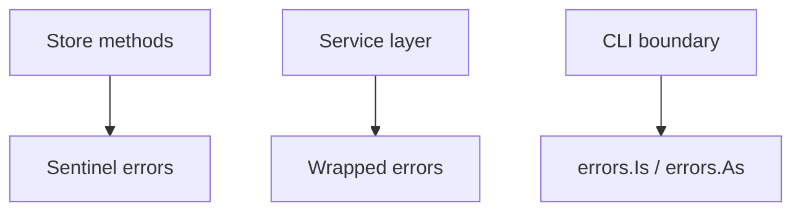

## Day 6 - Module 1.6: JSON File Persistence

### Design impact

- Added `saveJobs(...)`, `loadJobs(...)`, `Store.Save(...)`, and `LoadStore(...)`.
- Moved from ephemeral CLI behavior to persisted local state in `jobs.json`.

### Diagram

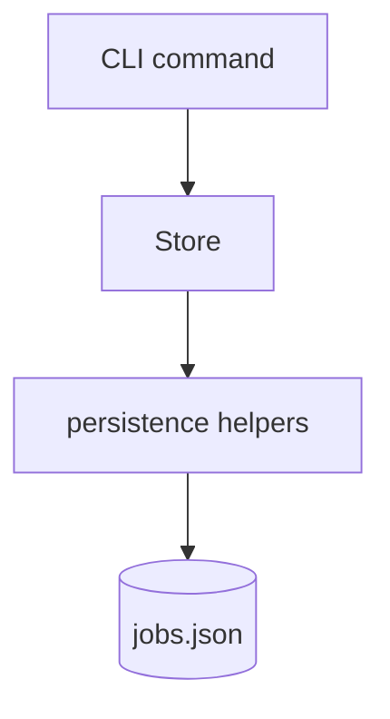

## Day 7 - Module 2.1: First HTTP API

### Design impact

- Added the first `net/http` transport layer.
- Reused the same job model and store behavior across CLI and HTTP.

### Diagram

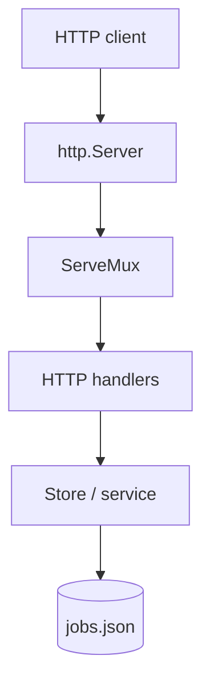

## Day 8 - Module 2.2: Middleware and Reliability Guards

### Design impact

- Added a distinct middleware layer.
- Centralized request IDs, recovery, body limits, and JSON content-type enforcement.

### Diagram

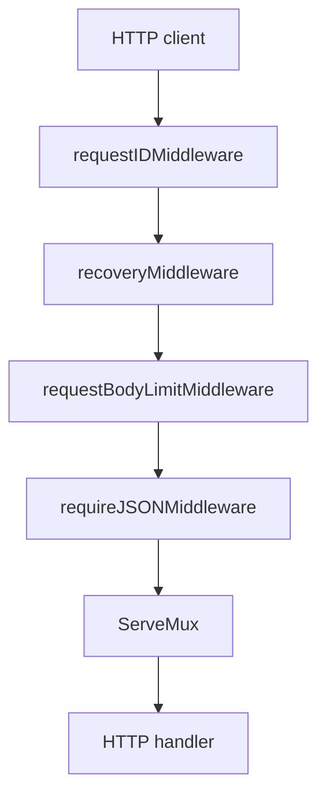

## Day 9 - Module 2.3: Core Package Extraction

### Design impact

- Extracted reusable application logic into `internal/goflow`.
- Corrected dependency direction so CLI and HTTP depend on the core package rather than the reverse.

### Diagram

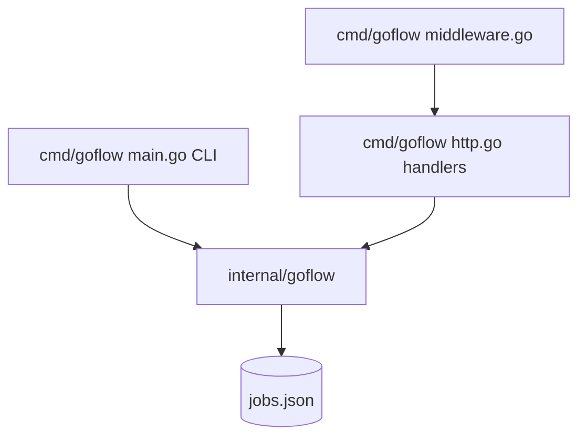

### Flow

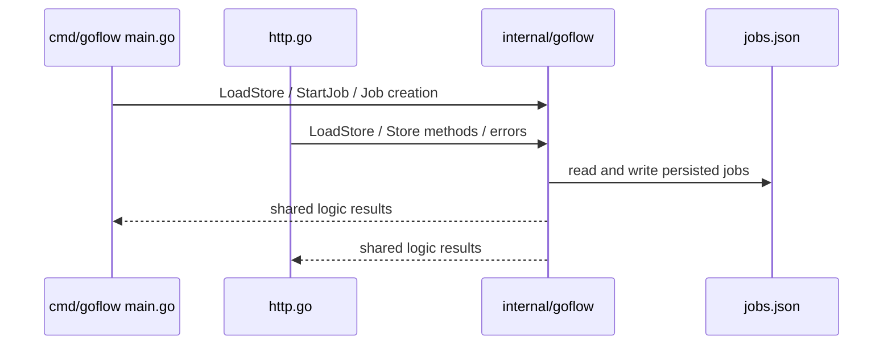

## Day 10 - Module 2.4: PostgreSQL Runtime Switch

### Goal

Replace the old file-based runtime path with PostgreSQL while keeping the higher-level service boundary clean.

### Design change

- Added `cmd/goflow/database.go` for database startup helpers.
- Added the PostgreSQL driver dependency with `github.com/lib/pq`.
- Added `openPostgresStore(...)` to read `DATABASE_URL`, open `*sql.DB`, configure pooling, run `PingContext(...)`, and apply the first migration.
- Switched CLI commands from `LoadStore(jobs.json)` to the PostgreSQL-backed repository.
- Switched HTTP handlers from file reloads to one shared store dependency.
- Updated `StartJob(...)` to use `context.Context` and the shared `JobStore` abstraction.
- Replaced sequential ID generation with random ID generation.

### Diagram

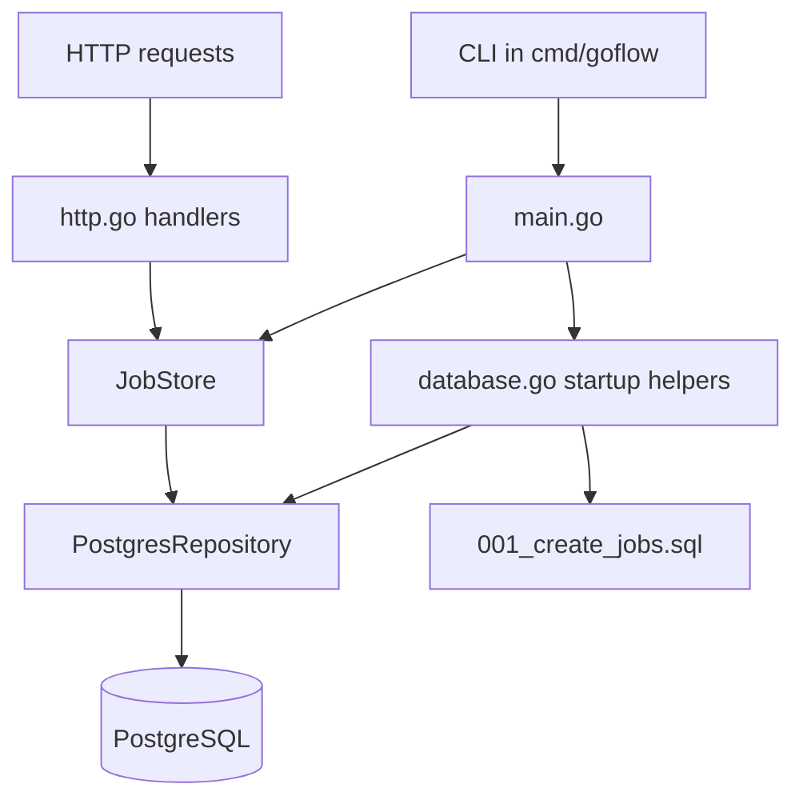

### Flow

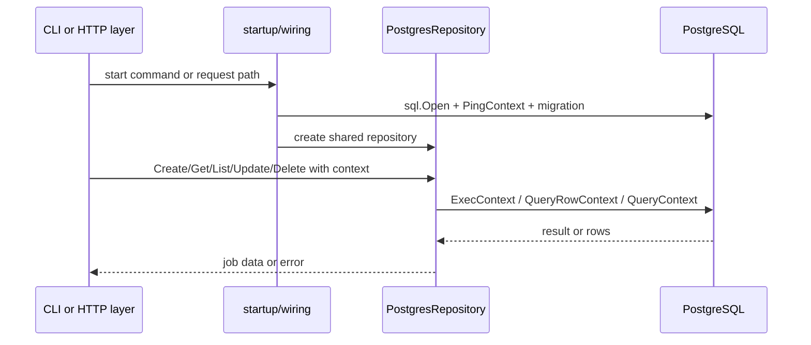

### Why this matters

- The app now targets a real relational persistence boundary.
- The service layer still depends on a store abstraction instead of SQL details.
- HTTP request context can flow into DB work.
- Startup owns connectivity checks and schema setup instead of handlers.

## Known Current Limitations

- Live PostgreSQL validation completed on 2026-09-02 through the repository integration test and real HTTP requests.
- The current schema still uses `BYTEA` for `payload`, which is simpler than the roadmap's suggested `JSONB` shape.
- The runtime was validated against a Docker-based PostgreSQL 16 container named `goflow-postgres`.
- Repository behavior now has `sqlmock` tests plus a real integration-test entry point.
- Content-type validation is still strict and does not yet allow variants like `application/json; charset=utf-8`.

## Related Documents

- `docs/tracker.md`
- `docs/learning.md`
- `docs/session-log.md`
- `docs/decisions.md`

## Day 11 - Module 2.5: Testing Layer Introduction

### Goal

Complete the first real testing layer for the PostgreSQL-backed API and ensure the Week 2 HTTP surface matches the roadmap deliverable.

### Design change

- Added `internal/goflow/service_test.go` for service-layer behavior.
- Added `cmd/goflow/http_test.go` for handler-level HTTP behavior.
- Added `internal/goflow/postgres_repository_test.go` for repository unit tests with `sqlmock`.
- Added `internal/goflow/postgres_repository_integration_test.go` for the real PostgreSQL path.
- Extended the HTTP API to support `DELETE /v1/jobs/{id}` and `GET /v1/jobs?status=...`.
- Introduced `jobByIDHandler` so one path can dispatch by method for single-job operations.

### Testing boundaries

- Service tests validate state-transition rules.
- Handler tests validate status codes, JSON bodies, validation failures, filtering, and deletion behavior.
- Repository tests validate SQL interactions and error mapping.
- Integration tests validate the live PostgreSQL path.

### Diagram

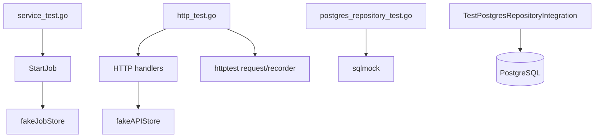

### Flow

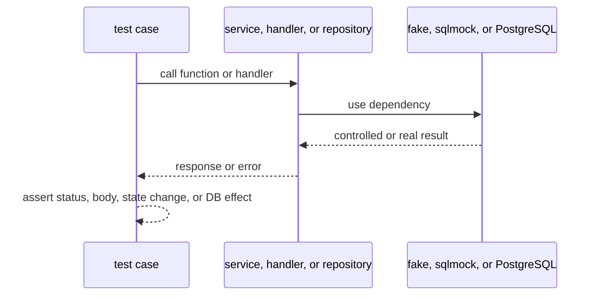

### Why this matters

- Testing now matches the architecture boundaries introduced earlier.
- The HTTP API now matches the Week 2 roadmap surface: create, retrieve, list, filter, and delete.
- Repository tests reduce the risk of silent SQL regressions.
- Live integration validation proves the PostgreSQL runtime, not just the test doubles.

## Day 11 Validation Update

- Live PostgreSQL integration was validated on 2026-09-02 with Docker PostgreSQL, `TestPostgresRepositoryIntegration`, and real HTTP requests to `/health/live`, `/v1/jobs`, and `/v1/jobs/{id}`.
- The test strategy now has four useful levels: service fakes, handler tests with `httptest`, repository tests with `sqlmock`, and a real database integration path.
- The Week 2 API surface now includes both `status` filtering on `GET /v1/jobs` and deletion through `DELETE /v1/jobs/{id}`.

## Day 13 - Module 3.1: First Worker Pipeline

### Goal

Introduce the first in-process concurrency flow for GoFlow without yet adding a full worker pool or atomic claim logic.

### Design change

- Added a new CLI command: `work`.
- `work` opens the PostgreSQL-backed store once.
- `work` creates `jobs chan string` carrying job IDs.
- One worker goroutine receives IDs and calls `goflow.StartJob(...)`.
- The poll loop lists pending jobs and enqueues their IDs.
- The worker now listens to both the jobs channel and `workCtx.Done()`.
- `signal.NotifyContext(...)` is used so the command can stop on interrupt.

### Diagram

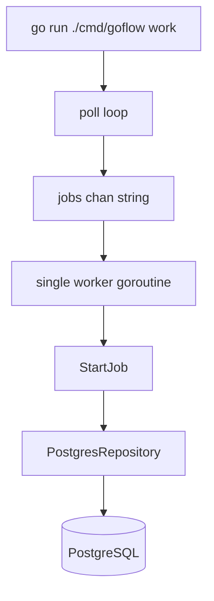

### Flow

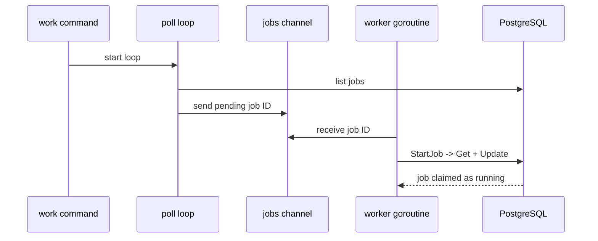

### Why this matters

- This is the first real producer/consumer pipeline in GoFlow.
- The command now demonstrates goroutine ownership, channel handoff, and context-based shutdown in real project code.
- The design still has duplicate-enqueue risk, which is a useful lead-in to later synchronization and claiming work.

### Day 13 completion update

- The `jobs` channel is now bounded with a small buffer instead of being unbuffered.
- This makes the queue behavior closer to a real work buffer while still preserving backpressure once the buffer fills.
- Shutdown now propagates through one owned context to both the poller and the worker.

## Day 14 - Module 3.2: Shared Bookkeeping Synchronization

### Goal

Protect the first shared in-memory bookkeeping used by the worker pipeline as GoFlow moves from basic concurrency into coordinated concurrency.

### Design change

- Added a mutex-protected `queued` set local to the `work` command.
- The poller records a job ID in the set before enqueueing it.
- The worker removes the job ID after the claim attempt finishes.
- The channel remains the communication path; the mutex protects only the separate shared map.

### Diagram

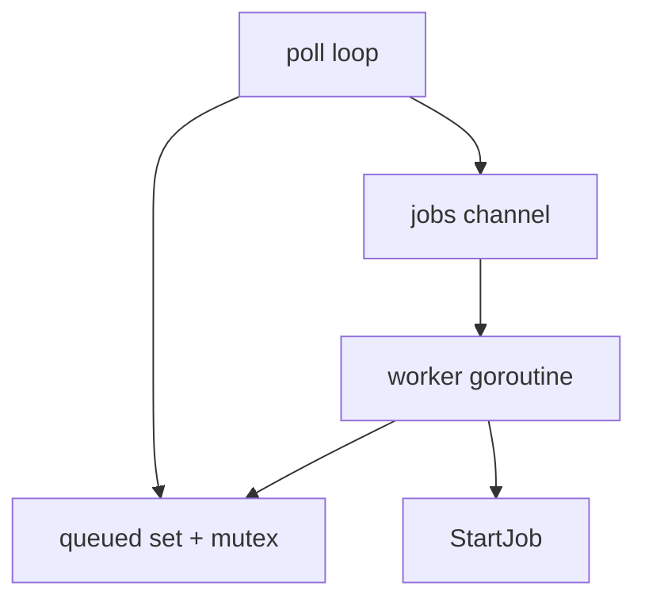

### Why this matters

- This is the first explicit shared-memory synchronization step in GoFlow.
- It demonstrates the boundary between channel-based communication and mutex-protected bookkeeping.
- It reduces duplicate enqueueing within the current process and prepares the design for a later worker pool.

## Day 15 - Module 3.3: Worker Pool Expansion

### Goal

Expand the single-worker pipeline into a small bounded worker pool while keeping ownership, queue behavior, and shutdown coordination explicit.

### Design change

- Added `workerCount = 3`.
- Replaced one worker goroutine with a loop that starts three workers.
- Added `sync.WaitGroup` so the `work` command waits for all workers to stop.
- Added worker IDs to processing, failure, and shutdown logs.
- Kept the same shared `jobs` channel and mutex-protected `queued` set.

### Diagram

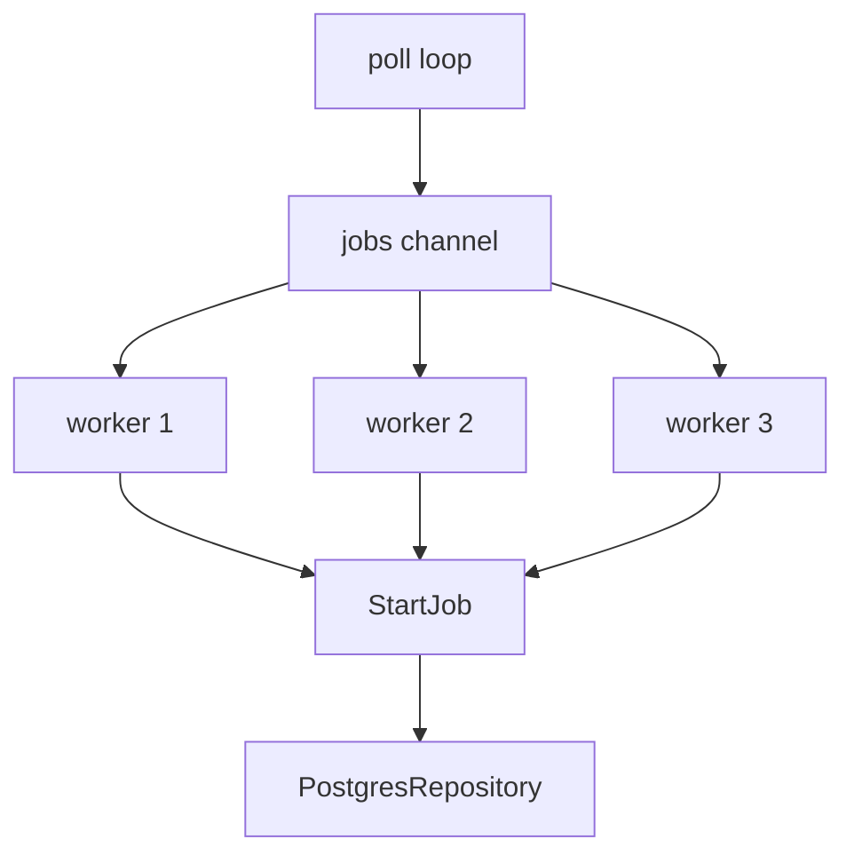

### Why this matters

- GoFlow now has bounded concurrent consumers instead of a single worker.
- The shared queue plus fixed worker count demonstrates the standard worker-pool pattern.
- Coordinated shutdown with `WaitGroup` becomes visible and necessary once the pool has several workers.
